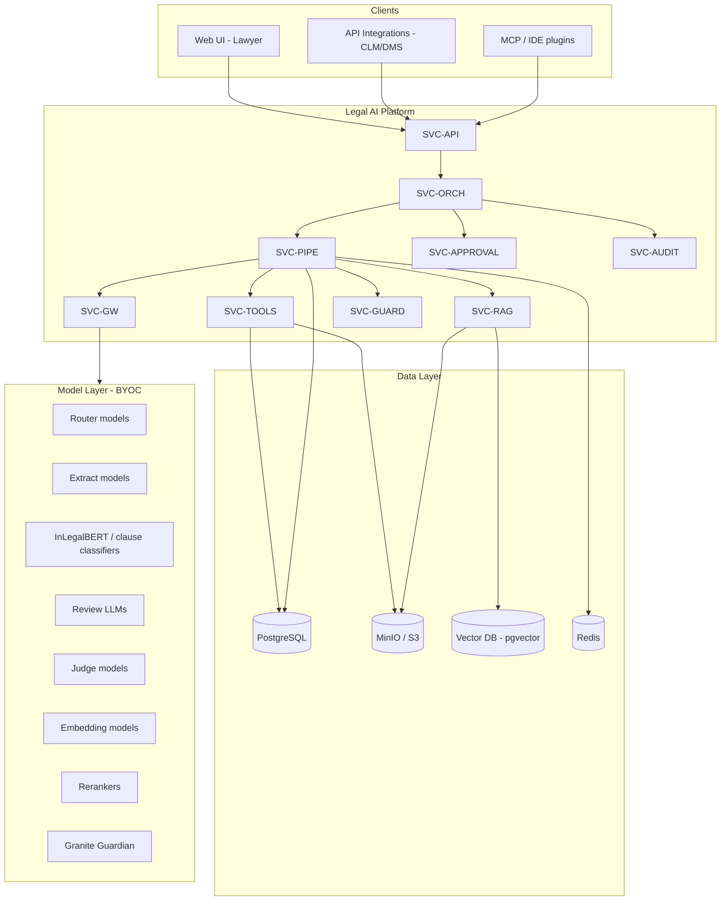
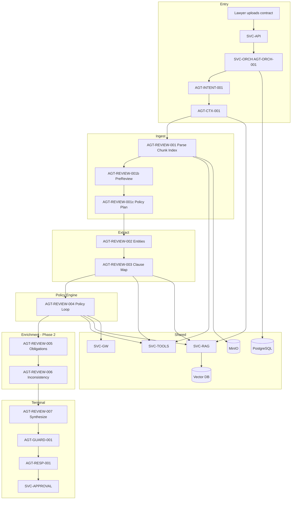
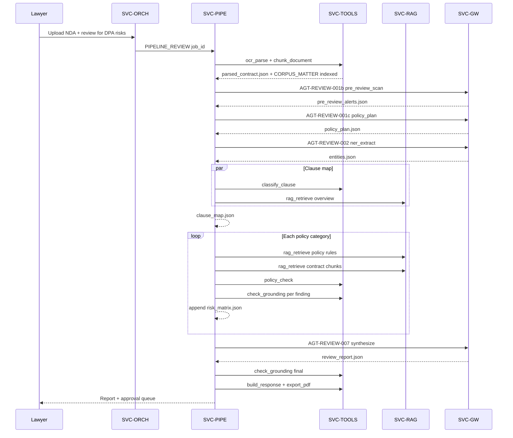
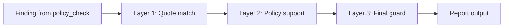
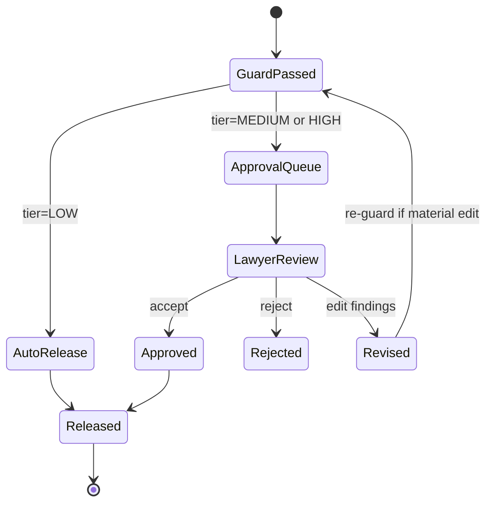
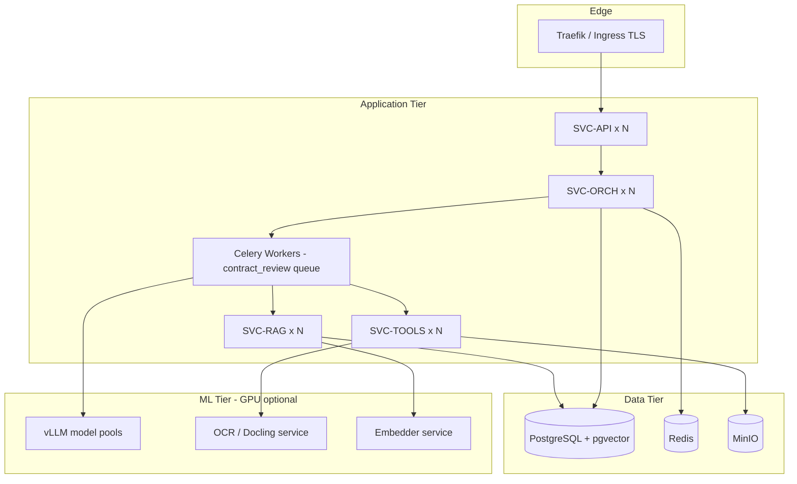

# PIPELINE_REVIEW — Production Architecture Specification

**Document ID:** `ARCH-PIPELINE-REVIEW-v1.0`  
**Pipeline ID:** `PIPELINE_REVIEW` (`review`)  
**Status:** Production design (target)  
**Last updated:** 2026-06-15  
**Scope:** NDA, MSA, DPA, PO, general commercial contracts + property subtype (sale deed, 7/12, encumbrance)

---

## Table of contents

1. [Executive summary](#1-executive-summary)
2. [Design principles](#2-design-principles)
3. [System context](#3-system-context)
4. [Entry, routing, and triggers](#4-entry-routing-and-triggers)
5. [End-to-end pipeline flow](#5-end-to-end-pipeline-flow)
6. [Services (SVC-*)](#6-services-svc)
7. [Agents (AGT-*)](#7-agents-agt)
8. [Tools (TLG-*)](#8-tools-tlg)
9. [Policy loop (core review engine)](#9-policy-loop-core-review-engine)
10. [RAG and corpora](#10-rag-and-corpora)
11. [Model gateway and routing](#11-model-gateway-and-routing)
12. [Data model and artifacts](#12-data-model-and-artifacts)
13. [Grounding, guard, and verification](#13-grounding-guard-and-verification)
14. [HITL and approval workflow](#14-hitl-and-approval-workflow)
15. [Security, privacy, and compliance](#15-security-privacy-and-compliance)
16. [Observability, audit, and SLOs](#16-observability-audit-and-slos)
17. [Deployment topology](#17-deployment-topology)
18. [API specification](#18-api-specification)
19. [Error handling and resilience](#19-error-handling-and-resilience)
20. [Testing and evaluation](#20-testing-and-evaluation)
21. [Phased delivery plan](#21-phased-delivery-plan)
22. [Appendices](#22-appendices)

---

## 1. Executive summary

`PIPELINE_REVIEW` is a **policy-grounded, multi-agent contract review pipeline** for law firms and in-house legal teams. It ingests contracts (PDF/DOCX/scans), structures them into clause-level chunks, classifies contract type and user position, retrieves firm playbooks and regulatory corpora, evaluates each policy category in a resumable loop, verifies every finding against source text, synthesizes a lawyer-ready report, and routes high-risk output through human approval.

### Core algorithm (notebook → production)

```
Parse & chunk contract
  → Classify type + build policy plan (LLM 1)
  → FOR each policy category:
        RAG(policy rules) + RAG(contract clauses)
        → policy_check (LLM 2)
        → per-finding grounding verify
        → RAG retry if clause/policy missing
  → Synthesize report from artifacts only
  → Final guard
  → HITL (configurable)
  → PDF + structured JSON output
```

### What makes this production-grade

| Capability | Implementation |
|------------|----------------|
| Grounded citations | Span-level quotes verified against `CORPUS_MATTER` |
| Policy-driven review | Firm playbooks in `CORPUS_POLICIES`, not ad-hoc prompts |
| Resumability | Per-step artifacts + checkpointed policy loop |
| Auditability | Every tool call and inference logged with hash chain |
| Model efficiency | Right-sized model per task via `SVC-GW` |
| Legal safety | Guard + HITL + disclaimer on all outputs |
| Multi-jurisdiction | `CORPUS_ACTS` (DPDP, IT Act) + property branch |

---

## 2. Design principles

### 2.1 Policy-grounded, not chat-grounded

The system does **not** ask a general LLM to "review this contract." It:

1. Determines **what** to check (policy plan).
2. Retrieves **rules** (firm playbook + statute corpus).
3. Retrieves **evidence** (matching contract clauses only).
4. Compares evidence to rules with structured output.
5. Verifies every claim before it enters the report.

### 2.2 Artifacts over monoliths

Each pipeline step produces a **versioned JSON artifact** stored in PostgreSQL + object storage. Downstream steps read artifacts; they do not re-parse the raw contract unless explicitly required.

### 2.3 Chunk by structure, retrieve by relevance

Contracts are chunked once at ingest by **section/clause/exhibit**, not arbitrary token windows. During review, only **top-k relevant chunks per policy category** are sent to the LLM.

### 2.4 Synthesis is read-only

The summary agent (`AGT-REVIEW-007`) **never** performs new retrieval or reads raw contract text. It only narrates artifacts from steps 002–006.

### 2.5 Fail closed on grounding

If a finding cannot be grounded to an exact quote in the source document, it is **dropped or flagged** — never silently included in the client-facing report.

### 2.6 Human-in-the-loop by default

Review reports default to `MEDIUM` HITL tier. Client-facing or high-severity outputs escalate to `HIGH`.

---

## 3. System context



### 3.1 Bounded context

| Context | Owns |
|---------|------|
| **Matter** | Case/deal workspace: documents, chat, artifacts, approvals |
| **Corpus** | Indexed knowledge: matter doc, policies, templates, acts |
| **Pipeline run** | Single execution of `PIPELINE_REVIEW` with state |
| **Artifact** | Immutable-ish versioned output of one agent step |
| **Finding** | One policy evaluation result with quote + severity |

---

## 4. Entry, routing, and triggers

### 4.1 Triggers

| Input | Intent | Pipeline |
|-------|--------|----------|
| User: *"Review this NDA for data protection risks"* + PDF | `review` | `PIPELINE_REVIEW` |
| Sale deed / 7/12 / encumbrance doc | `review_property` | `PIPELINE_REVIEW` + `AGT-REVIEW-008` |
| Ambiguous / multi-task request | `multi` | Coordinator fans out parallel pipelines |
| Low confidence intent | `clarify` | `AGT-RESP-001` asks clarifying question |

### 4.2 API entry

```http
POST /v1/matters/{matter_id}/chat
Content-Type: application/json
Authorization: Bearer <jwt>

{
  "message": "Review this NDA for data protection risks. We are the receiving party.",
  "attachments": [{ "document_id": "doc_abc123" }],
  "options": {
    "pipeline": "auto",
    "hitl_tier": "default",
    "risk_focus": ["data_protection", "confidentiality"]
  }
}
```

### 4.3 Routing chain

```
SVC-API
  → authn/authz (matter membership)
  → rate limit (per user / per firm)
  → SVC-ORCH (AGT-ORCH-001)
      → SVC-INTENT (AGT-INTENT-001)
      → delegate PIPELINE_REVIEW
      → SVC-CTX (AGT-CTX-001) assembles context pack
      → SVC-PIPE starts job
```

### 4.4 Default tool bundle (§8.1)

For `PIPELINE_REVIEW`: `ocr`, `classify`, `policy`

Interpreted as:

- **ocr** — ingest tools (`ocr_parse`, `extract_text`, `chunk_document`)
- **classify** — clause + contract type classification
- **policy** — RAG + `policy_check` over `CORPUS_POLICIES`

### 4.5 HITL defaults

| Output type | Default tier | Override |
|-------------|--------------|----------|
| Internal review report | `MEDIUM` | Firm config |
| Client-facing PDF | `HIGH` | Always |
| Critical finding (severity=critical) | `HIGH` | Always |
| Draft / exploratory | `LOW` | Opt-in auto-release |

---

## 5. End-to-end pipeline flow

### 5.1 Standard contract (NDA, MSA, DPA, PO)

```
AGT-ORCH-001
  → AGT-INTENT-001          (review | review_property | multi)
  → AGT-CTX-001             (context pack)
  → AGT-REVIEW-001          (parse + chunk + index)
  → AGT-REVIEW-001b         (pre-review scan)
  → AGT-REVIEW-001c         (contract classify + policy plan)
  → AGT-REVIEW-002          (entity extraction)
  → AGT-REVIEW-003          (clause map)
  → AGT-REVIEW-004          (policy loop — per category)
  → AGT-REVIEW-005          (obligations) [Phase 2]
  → AGT-REVIEW-006          (inconsistency) [Phase 2]
  → AGT-REVIEW-007          (synthesize report — artifacts only)
  → AGT-GUARD-001           (final grounding guard)
  → AGT-RESP-001            (UI + PDF + approval queue)
```

### 5.2 Property subtype

```
AGT-REVIEW-001
  → AGT-REVIEW-008          (property specialist parse)
  → AGT-REVIEW-001c         (policy plan — property pack)
  → AGT-REVIEW-003 → …      (same as standard)
```

### 5.3 Architecture diagram



### 5.4 Sequence diagram (one contract upload)



---

## 6. Services (SVC-*)

### 6.1 SVC-API

**Role:** Public HTTP/WebSocket gateway.

| Responsibility | Detail |
|----------------|--------|
| Authentication | JWT (firm SSO / Supabase / Auth0) |
| Authorization | Matter-level RBAC: `viewer`, `reviewer`, `approver`, `admin` |
| Rate limiting | Per-user, per-firm, per-endpoint (token bucket) |
| Upload handling | Pre-signed MinIO URLs; virus scan hook |
| SSE streaming | `GET /v1/pipeline-runs/{id}/events` |

**Does not:** Run LLM inference directly.

---

### 6.2 SVC-ORCH (`AGT-ORCH-001`)

**Role:** Top-level orchestrator for all pipelines.

| Responsibility | Detail |
|----------------|--------|
| Intent delegation | Routes to `PIPELINE_REVIEW`, research, draft, etc. |
| Job creation | Inserts `pipeline_runs` row, returns `job_id` |
| Context handoff | Calls `SVC-CTX` before pipeline start |
| Multi-pipeline | Fans out `multi` intents with coordinator |
| Cancellation | Propagates cancel to `SVC-PIPE` workers |

**Tools:** `delegate_pipeline`, `get_matter_context`, `log_audit_event`

**State machine:**

```
CREATED → CONTEXT_ASSEMBLED → PIPELINE_RUNNING → GUARD_PENDING → HITL_PENDING → COMPLETED
                                                              ↘ FAILED
                                                              ↘ CANCELLED
```

---

### 6.3 SVC-INTENT (`AGT-INTENT-001`)

**Role:** Classify user request into pipeline intent.

| Output | When |
|--------|------|
| `review` | Commercial contract review |
| `review_property` | Deed, 7/12, encumbrance |
| `multi` | Multiple distinct tasks detected |
| `clarify` | Confidence < 0.7 or missing document |

**Model route:** `route.router` (Ministral / Gemma — fast, cheap)

**Input:** User message + attachment metadata (mime, page count, filename heuristics)

**Output schema:**

```json
{
  "intent": "review",
  "confidence": 0.94,
  "signals": ["nda_filename", "review_keyword", "pdf_attachment"],
  "suggested_pipeline": "PIPELINE_REVIEW"
}
```

---

### 6.4 SVC-CTX (`AGT-CTX-001`)

**Role:** Assemble context pack for all downstream agents.

| Source | Content |
|--------|---------|
| Matter record | Client, counterparty, jurisdiction, matter type |
| Conversation memory | Prior chat turns (compacted) |
| Document list | All attachments + versions |
| Firm defaults | Preferred playbook, HITL tier, language |
| RAG prefetch | Recent templates, similar past reviews |

**Tools:** `rag_retrieve`, `get_conversation_memory`, `get_matter_context`

**Output:** `context_pack.json` (see [§12.3](#123-context_packjson))

---

### 6.5 SVC-PIPE

**Role:** Execute agent DAG for `PIPELINE_REVIEW`.

| Responsibility | Detail |
|----------------|--------|
| Step execution | Sequential agents with checkpoint after each |
| Parallel sub-steps | `classify_clause` ∥ `rag_retrieve` in step 003 |
| Policy loop | Iterates `policy_plan.categories[]` with retry |
| SSE events | Emits `step_started`, `step_completed`, `finding_added` |
| Idempotency | `job_id + step_id` dedup on retry |

**Implementation pattern:** Adapt from turn-loop orchestration (`query.ts` + `toolOrchestration.ts`):

- Each agent = one DAG node
- Read-only tools within a node may run in parallel
- Write artifacts = single transactional commit per step

**Queue:** Celery / Redis with dedicated `contract_review` queue for long jobs.

---

### 6.6 SVC-TOOLS

**Role:** Execute all `TLG-*` tools with uniform contract.

**Tool invocation contract:**

```json
{
  "tool_id": "TLG-004",
  "tool_name": "rag_retrieve",
  "matter_id": "matter_xyz",
  "pipeline_run_id": "run_123",
  "agent_id": "AGT-REVIEW-004",
  "params": { },
  "timeout_ms": 30000,
  "idempotency_key": "run_123:step_004:cat_liability:rag_1"
}
```

**Response:**

```json
{
  "status": "success",
  "result": { },
  "latency_ms": 842,
  "audit_id": "aud_456"
}
```

Every invocation → `SVC-AUDIT.log_audit_event`.

---

### 6.7 SVC-RAG

**Role:** Centralized hybrid retrieval across all corpora.

| Stage | Implementation |
|-------|----------------|
| Query embedding | `route.embed.long` (ModernBERT-embed / InLegal-SBERT) |
| Sparse search | BM25 on chunk text + section titles |
| Dense search | pgvector HNSW cosine similarity |
| Fusion | Reciprocal Rank Fusion (RRF) |
| Rerank | `route.rerank` (gte-reranker) → top 20 → pack 8k tokens |
| Access control | Filter by matter/firm corpus permissions |

**Never:** Return chunks from matters the user cannot access.

---

### 6.8 SVC-GW (Model Gateway)

**Role:** Single inference entry point for all LLM/classifier calls.

**Request envelope:**

```json
{
  "route_id": "route.llm.review",
  "agent_id": "AGT-REVIEW-004",
  "matter_id": "matter_xyz",
  "pipeline_run_id": "run_123",
  "messages": [],
  "grounding_pack_id": "gp_789",
  "temperature": 0.1,
  "max_tokens": 4096,
  "structured_output_schema": "RiskFinding"
}
```

**Responsibilities:**

- Route to correct model pool (vLLM / Bedrock / Azure OpenAI)
- Token accounting and cost attribution
- Circuit breaker on model failures
- Prompt injection fencing on all user content
- Request/response audit (redacted)

Agents **never** call vLLM directly.

---

### 6.9 SVC-GUARD

**Role:** Optional BYOC policy rules layer (supplements `TLG-034`).

| Check | Example |
|-------|---------|
| No uncited statutes | DPDP section must have `act_section_lookup` hit |
| No fabricated clauses | Quote substring match in source |
| PII leakage | No opposing party PII in wrong field |
| Disclaimer present | Report must include counsel disclaimer |

---

### 6.10 SVC-APPROVAL

**Role:** Human-in-the-loop queue.

| Tier | Behavior |
|------|----------|
| `LOW` | Auto-release after guard pass |
| `MEDIUM` | Queued for lawyer review; editable before release |
| `HIGH` | Requires named approver sign-off |

**States:** `PENDING` → `APPROVED` | `REJECTED` | `REVISED`

---

### 6.11 SVC-AUDIT

**Role:** Immutable audit log for compliance.

**Events:** `tool_called`, `inference_request`, `artifact_generated`, `finding_grounded`, `finding_rejected`, `approval_granted`, `report_exported`

**Storage:** Append-only table + optional WORM object storage export.

---

### 6.12 SVC-CITE (optional)

**Role:** Statutory and case citation verification when report cites external law.

**Tools:** `verify_citation`, `parse_indian_citation`, `act_section_lookup`

---

## 7. Agents (AGT-*)

### 7.0 Agent inventory

| Step | Agent ID | Name | Phase | Model route |
|------|----------|------|-------|-------------|
| 0 | `AGT-ORCH-001` | Main Orchestrator | MVP | `route.router` |
| 0 | `AGT-INTENT-001` | Intent Classifier | MVP | `route.router` |
| 0 | `AGT-CTX-001` | Context Assembler | MVP | embed via RAG |
| 1 | `AGT-REVIEW-001` | OCR & Document Parser | MVP | tools only |
| 1b | `AGT-REVIEW-001b` | Pre-Review Scanner | MVP | `route.llm.extract` |
| 1c | `AGT-REVIEW-001c` | Contract Classifier & Policy Planner | MVP | `route.router` |
| 2 | `AGT-REVIEW-002` | Entity Extraction | MVP | `route.extract` |
| 3 | `AGT-REVIEW-003` | Clause Detector | MVP | `route.classify.clause` |
| 4 | `AGT-REVIEW-004` | Risk & Policy Loop | MVP | `route.llm.review` |
| 5 | `AGT-REVIEW-005` | Obligations Extractor | Phase 2 | `route.extract` |
| 6 | `AGT-REVIEW-006` | Inconsistency Checker | Phase 2 | `route.llm.judge` |
| 7 | `AGT-REVIEW-007` | Review Synthesizer | MVP | `route.llm.indian_summary` |
| 8 | `AGT-REVIEW-008` | Property Specialist | Phase 2 | `route.extract` |
| 9 | `AGT-GUARD-001` | Grounding Guard | MVP | `route.guard` |
| 10 | `AGT-RESP-001` | Response Builder | MVP | `Phi-4-mini` + templates |

---

### 7.1 AGT-REVIEW-001 — OCR & Document Parser

**Purpose:** Transform raw upload into structured, indexed, chunk-embedded corpus.

**Model route:** Tools only (no LLM unless OCR confidence low)

**Tools:**

| Tool | When |
|------|------|
| `extract_text` | Native digital PDF / DOCX |
| `ocr_parse` | Scanned PDF or low text layer confidence |
| `chunk_document` | **Always** after parse |

**Processing steps:**

1. Fetch `document_id` → MinIO `matter_documents.s3_key`
2. Detect mime + text layer quality
3. Parse → pages, blocks, reading order
4. **Structural chunking** (mandatory):
   - Split by section headings (regex + layout model)
   - Split exhibits/schedules as separate chunks
   - Attach `section_id`, `title`, `page_start`, `page_end`, `char_span`
5. Embed all chunks → `CORPUS_MATTER` vector index
6. Store `parsed_contract.json`

**Output artifact:** `parsed_contract.json`

```json
{
  "document_id": "doc_abc123",
  "page_count": 24,
  "ocr_status": "done",
  "parse_confidence": 0.97,
  "chunks": [
    {
      "chunk_id": "chk_10_2",
      "section_id": "10.2",
      "title": "Limitation of Liability",
      "page_start": 18,
      "page_end": 18,
      "text": "...",
      "char_span": [45210, 46100]
    }
  ]
}
```

**Failure modes:**

| Failure | Action |
|---------|--------|
| OCR confidence < 0.6 | Flag `ocr_quality_warning`; continue with HITL flag |
| Parse timeout | Retry 2x; fail job with partial artifact |
| Encrypted PDF | Fail with user-actionable error |

**SLO:** P95 < 90s for 50-page PDF (excluding OCR cold start)

---

### 7.2 AGT-REVIEW-001b — Pre-Review Scanner

**Purpose:** Surface document completeness issues **before** legal analysis.

**Checks:**

| Check | Method |
|-------|--------|
| Blank placeholders | Regex: `$____`, `TBD`, `[amount]`, `___` |
| Missing exhibits | Cross-ref "Exhibit X" vs attached exhibits |
| Truncation | Page sequence gaps, "continued on next page" orphans |
| Signature status | Heuristic: signature blocks empty → `draft` |
| Scan quality | OCR confidence per page |

**Output artifact:** `pre_review_alerts.json`

```json
{
  "alerts": [
    {
      "severity": "high",
      "type": "blank_field",
      "message": "Fee amount in Section 4.1 is blank",
      "location": { "section_id": "4.1", "page": 7 }
    },
    {
      "severity": "critical",
      "type": "missing_exhibit",
      "message": "Exhibit B (SLA) referenced but not attached",
      "location": { "reference": "Exhibit B" }
    }
  ],
  "document_status": "draft"
}
```

These alerts are **pinned to the top** of the final report.

---

### 7.3 AGT-REVIEW-001c — Contract Classifier & Policy Planner

**Purpose:** This is **LLM 1** from the architecture notebook. Determines what to check.

**Inputs:**

- `parsed_contract.json` (first 10 pages + section TOC)
- User message ("receiving party", "DPA risks")
- `context_pack.json`

**Output artifact:** `policy_plan.json`

```json
{
  "contract_type": "nda",
  "contract_type_confidence": 0.96,
  "user_position": "receiving_party",
  "counterparty_position": "disclosing_party",
  "jurisdiction": "IN",
  "governing_law_detected": "India",
  "risk_focus": ["data_protection", "confidentiality"],
  "playbook_id": "nda_receiving_party_v2",
  "categories": [
    {
      "category_id": "confidentiality_definition",
      "priority": 1,
      "rag_queries": {
        "policy": "NDA confidentiality definition scope exceptions",
        "contract": "confidential information definition exceptions"
      }
    },
    {
      "category_id": "term_duration",
      "priority": 2,
      "rag_queries": {
        "policy": "NDA term duration survival trade secrets",
        "contract": "term termination survival obligations"
      }
    }
  ],
  "regulatory_flags": ["dpdp_cross_border_transfer"]
}
```

**Contract types supported:**

| Type | Playbook ID prefix |
|------|-------------------|
| NDA | `nda_*` |
| MSA / SaaS | `msa_*`, `saas_*` |
| DPA | `dpa_*` |
| PO | `po_*` |
| General | `general_commercial_v1` |

**Position-aware routing:** Same contract type, different policy packs for `customer` vs `vendor`, `buyer` vs `seller`, `receiving_party` vs `disclosing_party`.

---

### 7.4 AGT-REVIEW-002 — Entity Extraction

**Purpose:** Extract structured metadata for report header and cross-referencing.

**Model route:** `route.extract` (Aalap / dedicated NER)

**Tool:** `ner_extract`

**Output artifact:** `entities.json`

```json
{
  "parties": [
    { "name": "Acme Software Inc.", "role": "vendor", "confidence": 0.95 },
    { "name": "Client Corp Pvt Ltd", "role": "customer", "confidence": 0.93 }
  ],
  "dates": {
    "effective_date": "2026-01-01",
    "expiration_date": null,
    "signature_date": null
  },
  "amounts": [
    { "value": "120000", "currency": "INR", "context": "annual subscription" }
  ],
  "governing_law": "State of Delaware",
  "jurisdiction": "Delaware courts",
  "dispute_resolution": "arbitration"
}
```

---

### 7.5 AGT-REVIEW-003 — Clause Detector

**Purpose:** Build a typed map of all clauses in the contract.

**Execution:** Parallel:

```
par
  classify_clause(document) → clause labels per chunk
  rag_retrieve(playbook overview) → context for disambiguation
end
```

**Model route:** `route.classify.clause` (InLegalBERT)

**Fallback:** If confidence < 0.75 → LLM classify via `route.llm.review` on ambiguous chunks only.

**Output artifact:** `clause_map.json`

```json
{
  "clauses": [
    {
      "clause_id": "cl_10_2",
      "chunk_id": "chk_10_2",
      "type": "limitation_of_liability",
      "confidence": 0.91,
      "span": { "section_id": "10.2", "page": 18 },
      "text_preview": "Liability shall not exceed fees paid in the preceding three months..."
    }
  ],
  "coverage_summary": {
    "limitation_of_liability": 1,
    "indemnification": 2,
    "termination": 3,
    "confidentiality": 1
  }
}
```

**Clause types (aligned to CUAD + firm extensions):**

`confidentiality`, `limitation_of_liability`, `indemnification`, `termination`, `governing_law`, `ip_assignment`, `data_protection`, `sla`, `payment_terms`, `non_compete`, `assignment`, `amendment`, `force_majeure`, `dispute_resolution`, …

---

### 7.6 AGT-REVIEW-004 — Risk & Policy Loop

**Purpose:** Core review engine. **Per policy category**, compare contract clauses against firm rules and regulatory requirements.

See [§9 Policy loop](#9-policy-loop-core-review-engine) for full detail.

**Output artifact:** `risk_matrix.json` (appended per category)

---

### 7.7 AGT-REVIEW-005 — Obligations Extractor (Phase 2)

**Purpose:** Extract who must do what by when.

**Tool:** `extract_obligations`

**Output artifact:** `obligations.json`

```json
{
  "obligations": [
    {
      "party": "vendor",
      "action": "provide 99.9% uptime",
      "deadline": "ongoing",
      "trigger": "service period",
      "section_id": "Exhibit B.1",
      "penalty": "service credits per SLA table"
    }
  ]
}
```

---

### 7.8 AGT-REVIEW-006 — Inconsistency Checker (Phase 2)

**Purpose:** Cross-section conflicts — defined terms vs body, exhibit refs, numeric mismatches.

**Tool:** `compare_clauses` + `route.llm.judge`

**Output artifact:** `inconsistencies.json`

```json
{
  "conflicts": [
    {
      "type": "missing_exhibit_reference",
      "severity": "high",
      "description": "Section 5.2 references Exhibit C but Exhibit C not present",
      "locations": ["5.2"]
    },
    {
      "type": "defined_term_mismatch",
      "severity": "medium",
      "description": "'Confidential Information' defined in 3.1 but lowercase 'confidential information' in 7.4",
      "locations": ["3.1", "7.4"]
    }
  ]
}
```

---

### 7.9 AGT-REVIEW-007 — Review Synthesizer

**Purpose:** Produce final narrative report from artifacts **only**.

**CRITICAL CONSTRAINT:** No new `rag_retrieve`, no raw contract reads.

**Inputs:** `pre_review_alerts`, `entities`, `clause_map`, `risk_matrix`, `obligations`, `inconsistencies`, `policy_plan`

**Model route:** `route.llm.indian_summary`

**Tool:** `summarize_structured`

**Output artifact:** `review_report.json` (see [§12.4](#124-review_reportjson))

---

### 7.10 AGT-REVIEW-008 — Property Specialist (Phase 2)

**Purpose:** Parse Indian property records before generic clause pass.

**Tool:** `parse_property_record`

**Fields:** survey number, 7/12 extract fields, encumbrance status, title chain flags, RERA references

**Inserts after:** `AGT-REVIEW-001`, before `AGT-REVIEW-001c` (property policy pack)

---

### 7.11 AGT-GUARD-001 — Grounding Guard

**Purpose:** Final gate before user sees output.

**Model route:** `route.guard` (Granite Guardian BYOC)

**Tool:** `check_grounding`

**Checks:**

1. Every finding quote exists verbatim (normalized whitespace) in `CORPUS_MATTER`
2. Every statutory cite verified (if `SVC-CITE` enabled)
3. No new risks in narrative that aren't in `risk_matrix`
4. Disclaimer block present
5. Severity counts match

**Outcomes:**

| Result | Action |
|--------|--------|
| `pass` | Proceed to `AGT-RESP-001` |
| `rewrite` | Auto-fix minor issues (missing disclaimer); re-check |
| `block` | Hold report; queue for manual review with guard failure log |

---

### 7.12 AGT-RESP-001 — Response Builder

**Purpose:** Build API response, UI payload, PDF export, approval enqueue.

**Model route:** `Phi-4-mini` for light formatting only; mostly templates.

**Tools:** `build_response`, `export_pdf`, `enqueue_lawyer_approval`

**Output:**

- Web UI render model (sections, finding cards, click-to-source spans)
- `review_report.pdf`
- Approval queue entry if tier ≥ MEDIUM

---

## 8. Tools (TLG-*)

### 8.1 Ingest & read

#### TLG-001 `ocr_parse`

| Field | Value |
|-------|-------|
| **Purpose** | PDF/scan → text + layout |
| **Input** | `document_id`, `matter_id` |
| **Output** | `{ pages[], text_preview, ocr_confidence, document_id }` |
| **Side effects** | Writes parsed text to MinIO; sets `ocr_status=done` |
| **Called by** | `AGT-REVIEW-001` |
| **Timeout** | 120s (extendable for 200+ pages) |
| **Idempotent** | Yes — same `document_id + version` |

**Internal flow:**

1. Fetch from MinIO (`matter_documents.s3_key`)
2. Run OCR + layout model (Docling / proprietary)
3. Store page-level JSON in `parsed/{document_id}/`
4. Return preview (first 2k chars) to agent

---

#### TLG-002 `extract_text`

| Field | Value |
|-------|-------|
| **Purpose** | Native text extraction (no OCR) |
| **Input** | `document_id` |
| **When** | Digital PDF with text layer, DOCX |
| **Called by** | `AGT-REVIEW-001` |

---

#### TLG-003 `chunk_document`

| Field | Value |
|-------|-------|
| **Purpose** | Structural chunking + embedding |
| **Input** | `document_id`, `parsed_contract_ref` |
| **When** | **Mandatory** for all documents |
| **Called by** | `AGT-REVIEW-001` |

**Chunking rules:**

1. Prefer section headings over fixed token windows
2. Max chunk size: 1500 tokens (split long sections at paragraph boundaries)
3. Min chunk size: 50 tokens (merge tiny fragments)
4. Always separate exhibits/schedules
5. Store parent-child hierarchy (`section_id` tree)

**Embedding:**

- Model: `route.embed.long` (ModernBERT-embed)
- Index: `CORPUS_MATTER` in pgvector
- Metadata: `chunk_id`, `section_id`, `page`, `document_id`, `matter_id`

---

### 8.2 Knowledge & firm rules

#### TLG-004 `rag_retrieve`

| Field | Value |
|-------|-------|
| **Purpose** | Hybrid search across corpora |
| **Input** | `query`, `corpora[]`, `top_k`, `matter_id`, `filters` |
| **Output** | `{ chunks[], scores[], grounding_pack_id }` |
| **Called by** | `AGT-CTX-001`, `AGT-REVIEW-003`, `AGT-REVIEW-004` |

**Pipeline:**

```
query
  → embed (InLegal-SBERT + ModernBERT ensemble)
  → BM25 + vector search per corpus
  → RRF fusion
  → gte-rerank → top 20
  → token budget pack (max 8k tokens)
  → return grounding_pack_id (cached for audit)
```

**Corpus filter examples:**

```json
{ "corpora": ["CORPUS_MATTER"], "filters": { "section_types": ["limitation_of_liability"] } }
{ "corpora": ["CORPUS_POLICIES"], "filters": { "playbook_id": "nda_receiving_party_v2" } }
{ "corpora": ["CORPUS_ACTS"], "filters": { "act": "DPDP", "sections": ["8", "9"] } }
```

---

#### TLG-005 `policy_retrieve`

| Field | Value |
|-------|-------|
| **Purpose** | Fetch specific playbook rules (internal to `policy_check`) |
| **Input** | `playbook_id`, `category_id` |
| **Source** | `CORPUS_POLICIES` + structured `policy_rules` table |

---

#### TLG-006 `policy_check`

| Field | Value |
|-------|-------|
| **Purpose** | Compare contract clauses vs firm policy |
| **Input** | `category_id`, `policy_chunks[]`, `contract_chunks[]`, `user_position`, `context` |
| **Output** | `PolicyCheckResult` |
| **Called by** | `AGT-REVIEW-004` |

**Hybrid engine:**

1. **Rule engine** (deterministic): regex + numeric thresholds
   - e.g. liability cap < 6 months → auto FAIL
2. **LLM assessor** (`route.llm.review`): nuanced interpretation
3. **Merge** rule engine overrides LLM on hard thresholds

**Output per category:**

```json
{
  "category_id": "limitation_of_liability",
  "alignment": "FAIL",
  "severity": "critical",
  "findings": [
    {
      "finding_id": "fnd_001",
      "issue": "3-month liability cap below firm minimum of 12 months",
      "contract_quote": "fees paid in the preceding three (3) months",
      "quote_span": { "chunk_id": "chk_10_2", "char_start": 120, "char_end": 180 },
      "policy_reference": "FIRM-MSA-004: liability cap minimum 12 months fees",
      "market_standard": "12 months fees for SaaS customer agreements",
      "negotiability": "medium",
      "suggested_redline": "Change three (3) months to twelve (12) months",
      "fallback_position": "Accept 6 months as compromise"
    }
  ],
  "missing_clause": false
}
```

---

### 8.3 Extraction & analysis

#### TLG-014 `classify_clause`

InLegalBERT classifier → `{ clause_id, type, span, confidence }`

#### TLG-015 `ner_extract`

Parties, dates, amounts, jurisdiction

#### TLG-016 `extract_obligations`

Who / what / when / trigger / penalty table

#### TLG-037 `compare_clauses`

Cross-section inconsistency detection

#### TLG-038 `summarize_structured`

Template-driven synthesis from artifact bundle

#### TLG-025 `parse_property_record`

7/12, sale deed, encumbrance structured fields

---

### 8.4 Terminal & platform

#### TLG-034 `check_grounding`

| Check | Method |
|-------|--------|
| Quote exists | Normalized substring match in source chunk |
| Statute exists | `act_section_lookup` (optional) |
| No hallucinated risks | Diff narrative claims vs `risk_matrix` |
| Model guard | Granite Guardian classification |

**Per-finding mode** (in policy loop):

```json
{ "mode": "finding", "quote": "...", "chunk_id": "chk_10_2" }
→ { "grounded": true, "match_score": 0.99 }
```

**Final report mode:**

```json
{ "mode": "report", "review_report_id": "..." }
→ { "result": "pass" | "rewrite" | "block", "issues": [] }
```

#### TLG-023 `export_pdf`

Lawyer-ready PDF with finding table, severity colors, appendix of quotes

#### TLG-049 `build_response`

Final API/UI payload assembly

#### TLG-M01 `get_matter_context`

#### TLG-M02 `enqueue_lawyer_approval`

#### TLG-M03 `log_audit_event`

---

### 8.5 Optional tools

| Tool | When |
|------|------|
| `TLG-007/008` `web_search` / `web_fetch` | Regulation not in `CORPUS_ACTS` |
| `TLG-009/010` citation verify | Report cites case law |
| `TLG-011` `act_section_lookup` | Pinpoint DPDP sections |
| `spawn_worker_agent` | Parallel policy categories |

---

### 8.6 Tool count summary

| Category | Tools | MVP |
|----------|-------|-----|
| Ingest | `ocr_parse`, `extract_text`, `chunk_document` | ✓ |
| RAG/Policy | `rag_retrieve`, `policy_check` | ✓ |
| Analysis | `classify_clause`, `ner_extract`, `summarize_structured` | ✓ |
| Terminal | `check_grounding`, `build_response`, `export_pdf` | ✓ |
| Platform | `get_matter_context`, `get_conversation_memory`, `enqueue_lawyer_approval`, `log_audit_event` | ✓ |
| Phase 2 | `extract_obligations`, `compare_clauses`, `parse_property_record` | defer |
| Optional | web, cite, act lookup | defer |

**MVP unique tools: ~14**

---

## 9. Policy loop (core review engine)

This section details `AGT-REVIEW-004` — the heart of the system.

### 9.1 Loop structure

```python
# Conceptual — runs inside SVC-PIPE worker
for category in policy_plan.categories:  # ordered by priority
    result = await run_category_review(
        category=category,
        policy_plan=policy_plan,
        clause_map=clause_map,
        context_pack=context_pack,
        max_rag_retries=2,
    )
    risk_matrix.append(result)
    await checkpoint(pipeline_run_id, step="004", category=category.id)
    emit_sse("finding_added", result)
```

### 9.2 Per-category algorithm

```
1. SELECT candidate contract chunks
     a. From clause_map where type matches category
     b. If empty → rag_retrieve(contract query from policy_plan)

2. RETRIEVE policy rules
     → policy_retrieve(playbook_id, category_id)
     → rag_retrieve(policy query, CORPUS_POLICIES)
     → if regulatory_flags → rag_retrieve(CORPUS_ACTS)

3. POLICY CHECK
     → policy_check(category, policy_chunks, contract_chunks, user_position)

4. GROUND each finding
     → check_grounding(finding.quote, chunk_id)
     → if not grounded → drop finding, log audit

5. MISSING CLAUSE handling
     if result.missing_clause:
         → rag_retrieve(broader contract query)  # feedback arrow
         → retry policy_check (max 2)
         → if still missing → record as MISSING_PROVISION finding

6. APPEND to risk_matrix.json
```

### 9.3 Parallelization

Independent categories may run in parallel via `spawn_worker_agent`:

```
Parallel batch 1: [liability, indemnification, termination]
Parallel batch 2: [data_protection, confidentiality, sla]
```

**Constraint:** Max 4 parallel workers per pipeline run (cost + rate limit).

### 9.4 Retry policy

| Condition | Action |
|-----------|--------|
| RAG returns 0 chunks | Broaden query → retry |
| `policy_check` timeout | Retry 1x with smaller chunk pack |
| Grounding fail | Drop finding; do not retry LLM |
| LLM rate limit | Exponential backoff via SVC-GW |

### 9.5 Category catalog (NDA example)

| category_id | Priority | Hard rule example |
|-------------|----------|-------------------|
| `confidentiality_definition` | 1 | Must have standard exceptions |
| `term_duration` | 2 | Term < 2 years → flag |
| `return_destruction` | 3 | Must require certification |
| `residuals_clause` | 4 | Residuals → flag for receiving party |
| `non_solicitation` | 5 | Duration > 12 months → flag |
| `dpdp_cross_border` | 6 | Cross-border transfer without consent → critical |

Full playbooks stored in `CORPUS_POLICIES` as versioned YAML/JSON.

---

## 10. RAG and corpora

### 10.1 Corpus definitions

| Corpus ID | Content | Scoped by |
|-----------|---------|-----------|
| `CORPUS_MATTER` | Contract under review (chunked) | `matter_id` |
| `CORPUS_CONTRACTS` | Firm past NDAs/MSAs/templates | `firm_id` |
| `CORPUS_POLICIES` | Review playbooks, fallback language | `firm_id` |
| `CORPUS_ACTS` | DPDP, IT Act, RERA, contract act | Global + `jurisdiction` filter |

### 10.2 Index schema (per chunk)

```sql
CREATE TABLE corpus_chunks (
  id            UUID PRIMARY KEY,
  corpus_id     TEXT NOT NULL,
  matter_id     UUID,
  firm_id       UUID NOT NULL,
  document_id   UUID,
  chunk_id      TEXT NOT NULL,
  section_id    TEXT,
  title         TEXT,
  text          TEXT NOT NULL,
  embedding     vector(768),
  metadata      JSONB,
  created_at    TIMESTAMPTZ DEFAULT now()
);

CREATE INDEX ON corpus_chunks USING hnsw (embedding vector_cosine_ops);
```

### 10.3 Retrieval quality requirements

| Metric | Target |
|--------|--------|
| Recall@10 for clause retrieval | ≥ 0.85 on golden set |
| Policy rule retrieval accuracy | ≥ 0.90 |
| Reranker latency P95 | < 200ms |

### 10.4 Embedding strategy

- **Contract chunks:** ModernBERT-embed (long context)
- **Legal policy text:** InLegal-SBERT (domain tuned)
- **Ensemble:** Average embeddings or RRF across both indexes for cross-corpus queries

---

## 11. Model gateway and routing

### 11.1 Route table

| Route ID | Model | Used by | Latency target |
|----------|-------|---------|----------------|
| `route.router` | Ministral / Gemma 3 | Intent, policy plan | < 2s |
| `route.extract` | Aalap / extract LLM | NER, obligations | < 5s |
| `route.classify.clause` | InLegalBERT | Clause map | < 1s / chunk batch |
| `route.llm.review` | INLegalLlama / review-tuned | Policy check | < 15s / category |
| `route.llm.judge` | Judge model | Inconsistency | < 10s |
| `route.llm.indian_summary` | Summary model | Synthesize | < 20s |
| `route.guard` | Granite Guardian | Grounding guard | < 5s |
| `route.embed.long` | ModernBERT-embed | RAG index/query | < 500ms |
| `route.rerank` | gte-reranker | RAG rerank | < 200ms |

### 11.2 Gateway features

- **Circuit breaker:** 5 failures in 60s → fallback route
- **Token budget:** Per-matter daily cap (firm config)
- **Caching:** Identical `rag_retrieve` query → cache 1h
- **Prompt fencing:** All document text in `<user_content>` tags
- **Structured output:** JSON schema validation on all agent outputs

### 11.3 Cost attribution

Every inference tagged: `firm_id`, `matter_id`, `pipeline_run_id`, `agent_id`, `route_id`, `input_tokens`, `output_tokens`, `cost_usd`

---

## 12. Data model and artifacts

### 12.1 Core tables

```sql
-- Matters (workspace)
matters (id, firm_id, title, client_id, jurisdiction, created_by, ...)

-- Documents
matter_documents (id, matter_id, s3_key, mime, page_count, ocr_status, version, ...)

-- Pipeline execution
pipeline_runs (
  id, matter_id, pipeline_id, status, intent,
  context_pack_id, policy_plan_id,
  hitl_tier, started_at, completed_at,
  error_message, checkpoint JSONB
)

-- Artifacts (versioned)
artifacts (
  id, pipeline_run_id, agent_id, artifact_type,
  s3_key, content_hash, version, created_at
)

-- Findings
review_findings (
  id, pipeline_run_id, category_id, severity, alignment,
  contract_quote, policy_reference, suggested_redline,
  chunk_id, grounded, approved, ...
)

-- Approvals
approval_queue (
  id, pipeline_run_id, tier, status,
  assigned_to, decided_by, decided_at, notes
)

-- Audit (append-only)
audit_events (
  id, firm_id, matter_id, pipeline_run_id,
  event_type, payload JSONB, content_hash, prev_hash, created_at
)
```

### 12.2 Artifact catalog

| Artifact | Agent | Format |
|----------|-------|--------|
| `parsed_contract.json` | 001 | Text + page map + chunks |
| `pre_review_alerts.json` | 001b | Alerts array |
| `policy_plan.json` | 001c | Categories + playbook |
| `entities.json` | 002 | NER output |
| `clause_map.json` | 003 | Typed clauses |
| `risk_matrix.json` | 004 | Findings per category |
| `obligations.json` | 005 | Obligations table |
| `inconsistencies.json` | 006 | Conflicts |
| `review_report.json` | 007 | Full structured report |
| `review_report.pdf` | RESP | PDF binary |

**Storage:** PostgreSQL metadata + MinIO `artifacts/{pipeline_run_id}/{artifact_type}/v{n}.json`

**Immutability:** New version on re-run; old versions retained for audit.

### 12.3 `context_pack.json`

```json
{
  "matter_id": "matter_xyz",
  "firm_id": "firm_abc",
  "user_id": "user_123",
  "user_role": "reviewer",
  "jurisdiction": "IN",
  "language": "en",
  "hitl_tier_default": "MEDIUM",
  "conversation_summary": "...",
  "documents": [{ "document_id": "doc_abc", "filename": "NDA.pdf", "version": 1 }],
  "firm_playbook_default": "nda_receiving_party_v2",
  "prefetched_chunks": []
}
```

### 12.4 `review_report.json`

```json
{
  "report_id": "rpt_789",
  "document_name": "Mutual NDA - Acme.pdf",
  "contract_type": "nda",
  "user_position": "receiving_party",
  "overall_risk": "medium",
  "document_status": "draft",
  "pre_signing_alerts": [],
  "executive_summary": "...",
  "key_terms": [
    { "term": "Term", "value": "3 years", "location": "Section 5.1" }
  ],
  "red_flags_scan": [
    { "flag": "Liability cap < 6 months", "found": false }
  ],
  "findings": [],
  "missing_provisions": [],
  "inconsistencies": [],
  "negotiation_priority": [
    { "rank": 1, "issue": "residuals clause", "ask": "Remove residuals", "negotiability": "high" }
  ],
  "disclaimer": "This review is for informational purposes only..."
}
```

---

## 13. Grounding, guard, and verification

### 13.1 Three-layer verification



| Layer | When | Method |
|-------|------|--------|
| **L1 Citation** | Per finding in step 004 | `check_grounding` substring match in chunk |
| **L2 Policy** | Per finding | Policy chunk must support the verdict |
| **L3 Report** | After step 007 | Granite Guardian + narrative diff vs risk_matrix |

### 13.2 Quote matching algorithm

1. Normalize whitespace and smart quotes
2. Exact substring search in source chunk
3. If fail → fuzzy align (Levenshtein ≤ 5% for OCR noise)
4. If still fail → `grounded=false` → finding dropped

### 13.3 Fail-closed rules

- Ungrounded finding → **never** in client PDF
- Ungrounded finding → may appear in internal draft with `UNVERIFIED` badge (firm config)
- Guard `block` → report not released until manual fix

---

## 14. HITL and approval workflow

### 14.1 Flow



### 14.2 Lawyer review UI capabilities

- View findings with click-to-source in PDF viewer
- Accept / reject / edit each finding
- Edit redline suggestions
- Add manual findings
- Approve or return to pipeline

### 14.3 Feedback loop

Lawyer rejections → `eval_feedback` table → golden set for regression tests and playbook tuning.

---

## 15. Security, privacy, and compliance

### 15.1 Authentication & authorization

| Layer | Control |
|-------|---------|
| API | JWT + firm tenancy |
| Matter | RBAC: viewer < reviewer < approver < admin |
| Corpus | Firm-scoped; matter docs isolated |
| Tools | Permission check before every `TLG-*` call |

### 15.2 Data protection

| Requirement | Implementation |
|-------------|----------------|
| Encryption at rest | MinIO SSE + Postgres TDE |
| Encryption in transit | TLS 1.3 everywhere |
| PII handling | Optional pre-LLM redaction service |
| Data residency | Firm-configurable region (IN/EU) |
| Retention | Configurable per firm; right-to-delete API |

### 15.3 Prompt injection defense

- All contract text fenced in `<user_content>` tags
- `UNTRUSTED_CONTENT_NOTICE` in every agent system prompt
- Tool outputs truncated before re-entry to context
- Corpus memory treated as untrusted user input

### 15.4 Audit & compliance

- Append-only audit log with hash chain
- Every inference logged (prompt hash, not always full prompt)
- SOC2-ready: access logs, change management, backup policy
- Legal disclaimer on every report

---

## 16. Observability, audit, and SLOs

### 16.1 Metrics (Prometheus)

| Metric | Labels |
|--------|--------|
| `pipeline_run_duration_seconds` | pipeline_id, status |
| `agent_step_duration_seconds` | agent_id |
| `policy_category_duration_seconds` | category_id |
| `findings_total` | severity, alignment |
| `grounding_failures_total` | agent_id |
| `rag_retrieve_latency_seconds` | corpus_id |
| `llm_tokens_total` | route_id, firm_id |
| `approval_queue_depth` | tier |

### 16.2 Logging

Structured JSON logs: `trace_id`, `pipeline_run_id`, `agent_id`, `step`, `latency_ms`

### 16.3 Tracing

OpenTelemetry spans: API → ORCH → PIPE → TOOL/RAG/GW

### 16.4 SLOs

| SLO | Target |
|-----|--------|
| Pipeline success rate | ≥ 99% (excl. user doc errors) |
| NDA review P95 latency | < 8 minutes |
| 50-page MSA P95 latency | < 20 minutes |
| Grounding pass rate | ≥ 95% of emitted findings |
| API availability | 99.9% |

### 16.5 Alerting

- Pipeline failure rate > 5% in 15m → PagerDuty
- Guard block rate > 20% → playbook/model drift alert
- LLM gateway circuit open → immediate

---

## 17. Deployment topology



### 17.1 Scaling guidelines

| Component | Scale trigger |
|-----------|---------------|
| `SVC-API` | CPU > 70% or RPS > 500 |
| `contract_review` workers | Queue depth > 10 |
| `SVC-RAG` | P95 latency > 500ms |
| vLLM review pool | GPU util > 80% |
| pgvector | Index size > 50M chunks → read replicas |

### 17.2 Environment separation

| Env | Purpose |
|-----|---------|
| `dev` | Local docker-compose |
| `staging` | Full stack + golden eval on every deploy |
| `prod` | Multi-AZ, BYOC models, firm data isolated |

---

## 18. API specification

### 18.1 Start review

```http
POST /v1/matters/{matter_id}/chat
```

Response:

```json
{
  "pipeline_run_id": "run_123",
  "status": "PIPELINE_RUNNING",
  "sse_url": "/v1/pipeline-runs/run_123/events"
}
```

### 18.2 Stream progress (SSE)

```http
GET /v1/pipeline-runs/{run_id}/events
```

Events:

```
event: step_started
data: {"step":"AGT-REVIEW-001","timestamp":"..."}

event: step_completed
data: {"step":"AGT-REVIEW-001","artifact_id":"art_456"}

event: finding_added
data: {"category_id":"limitation_of_liability","severity":"critical"}

event: pipeline_completed
data: {"report_id":"rpt_789","approval_required":true}
```

### 18.3 Get report

```http
GET /v1/matters/{matter_id}/reviews/{report_id}
```

### 18.4 Approval

```http
POST /v1/approvals/{approval_id}/decide
{ "decision": "approved", "notes": "..." }
```

---

## 19. Error handling and resilience

### 19.1 Pipeline-level

| Error | Handling |
|-------|----------|
| Step timeout | Checkpoint → retry step (max 3) |
| Worker crash | Resume from last checkpoint |
| User cancel | Graceful stop; partial artifacts retained |
| Model unavailable | Fallback route via SVC-GW |

### 19.2 Category-level (policy loop)

Failed category → log + continue to next category; mark `risk_matrix.categories_failed[]`

### 19.3 Partial success

Report may ship with:

```json
{
  "completeness": {
    "categories_total": 12,
    "categories_completed": 11,
    "categories_failed": ["dpdp_cross_border"],
    "warnings": ["Review incomplete — manual check required for DPDP cross-border"]
  }
}
```

---

## 20. Testing and evaluation

### 20.1 Test pyramid

| Level | Coverage |
|-------|----------|
| Unit | Tools, grounding matcher, rule engine |
| Integration | Each agent step with VCR-recorded LLM |
| Pipeline E2E | Golden NDAs/MSAs full run |
| Eval | ContractNLI, LegalBenchRAG, firm golden set |

### 20.2 Golden set requirements

- 20 NDAs (mutual, one-way, receiving/disclosing)
- 20 MSAs/SaaS (customer/vendor positions)
- 10 DPAs with DPDP scenarios
- 5 intentionally broken docs (missing exhibits, blanks)

### 20.3 CI gates

| Gate | Threshold |
|------|-----------|
| Grounding accuracy | ≥ 95% |
| Category recall | ≥ 85% |
| False critical rate | < 5% |
| Regression vs prior playbook version | No decrease |

### 20.4 Lawyer feedback loop

`approval_rejections` → labeled training data → quarterly playbook + eval refresh

---

## 21. Phased delivery plan

### Phase 1 — MVP (8–10 weeks)

**Agents:** 001, 001b, 001c, 002, 003, 004, 007, GUARD, RESP  
**Tools:** TLG-001–006, 014–016, 034, 049, M01–M03  
**Playbooks:** NDA (receiving + disclosing), basic MSA customer  
**HITL:** MEDIUM default  
**Defer:** 005, 006, 008, web search, property

**Exit criteria:**

- End-to-end NDA review < 8 min P95
- Grounding pass rate ≥ 90%
- 5 pilot lawyers using daily

### Phase 2 — Enrichment (6 weeks)

- Obligations + inconsistency agents
- DPA playbook + DPDP corpus
- Parallel policy workers
- Property branch (008)

### Phase 3 — Enterprise (ongoing)

- CLM integrations (webhook + worker upload API)
- Custom firm playbook editor
- SOC2 audit package
- Multi-region deployment

---

## 22. Appendices

### Appendix A — Policy pack schema

```yaml
playbook_id: nda_receiving_party_v2
version: "2.1.0"
contract_type: nda
user_position: receiving_party
jurisdiction: [IN, US, GLOBAL]

categories:
  - id: confidentiality_definition
    priority: 1
    rag_queries:
      policy: "NDA confidentiality definition scope standard exceptions"
      contract: "confidential information definition exceptions"
    hard_rules:
      - type: must_contain_any
        values: ["publicly available", "public domain", "independently developed"]
        severity: important
        message: "Missing standard confidentiality exceptions"

  - id: limitation_of_liability
    priority: 5
    hard_rules:
      - type: numeric_months_cap
        field: liability_cap_months
        min: 6
        severity: critical
        message: "Liability cap below 6 months"
```

### Appendix B — Red flag quick scan (pre-deep analysis)

| Red flag | Severity |
|----------|----------|
| Liability cap < 6 months | critical |
| Uncapped indemnification | critical |
| Unilateral amendment rights | important |
| No termination for convenience | important |
| Perpetual obligations | important |
| Offshore jurisdiction (BVI, Cayman) | important |
| Class action waiver + mandatory arbitration | review |

### Appendix C — Mapping to reference implementations

| This spec | Reference repo |
|-----------|----------------|
| Parse + chunk + embed | OpenContracts `pipeline/` |
| Span grounding | OpenContracts `extraction_grounding.py` |
| Tool registry + approval | OpenContracts `tool_registry.py` |
| Policy loop | PAKTON Interrogator graph pattern |
| CUAD categories | claude-legal-skill `skill.md` |
| Orchestration loop | `query.ts` + `toolOrchestration.ts` pattern |

### Appendix D — Glossary

| Term | Definition |
|------|------------|
| **Matter** | Legal workspace for one deal/case |
| **Playbook** | Versioned set of review rules per contract type + position |
| **Finding** | One assessed issue with quote, severity, redline |
| **Grounding** | Proof that a quote exists in source document |
| **HITL** | Human-in-the-loop approval before release |
| **Policy loop** | Per-category RAG + policy_check iteration |

---

*End of document `ARCH-PIPELINE-REVIEW-v1.0`*
