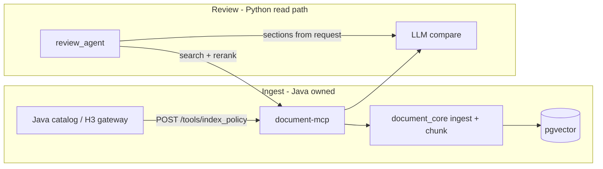

# Phase 36 — Remove Normalization, H3, and Duplicate Sync Paths

**Status:** COMPLETE (removal only — no replacement ingest harness)  
**Plan ID:** `DR-PHASE-36-INGEST-SIMPLIFY`  
**Priority:** P0 (architecture cleanup — blocks chunking/retrieval work)  
**Scope:** Python — `normalization/`, `document_core`, document-mcp, `legal_ai_platform`, `temp_java_sync`, CI, docker-compose  
**Estimated diff:** ~8k LOC deleted, ~400 LOC changed (wiring + dev harness)  
**Depends on:** Phase 26 (`metadata_at_ingest`), Phase 32 (integration tests)  
**Non-goals:** Java implementation, frontend, research agent, new chunking algorithm (→ Phase 37), retrieval tuning (→ Phase 35, revised)

---

## 1. Goal

Remove **redundant ingest paths** so there is **one writer** into pgvector:

```
Java (policies + contract sections) ──► document-mcp ingest ──► pgvector
                                              ▲
Review (read-only) ── sections + policy IDs ─┘
```

After this phase:

- No `normalization` package, no H3 client in Python, no Python catalog pull (`catalog_sync`).
- Review runtime unchanged: **classify → retrieve → rerank → compare**.
- Dev/benchmark harness calls **`/tools/index_policy`** directly (fixtures → `IngestRequest`), not normalization sync.

**Then** (Phase 37 + revised Phase 35): improve **chunking** and **retrieval** on the simplified stack.

---

## 2. Why now

| Problem | Today | After P36 |
|---------|-------|-----------|
| Two policy writers | Java catalog + `catalog_sync` + normalization sync | Java → `index_policy` only |
| Three contract paths | H3 fetch, normalization upload, Java sections | Java sections in review request |
| Drift | Different chunk shapes from normalizers vs `document_core` chunker | Single chunker in `document_core` |
| CI noise | Whole `normalization` job + platform H3 tests | Review + document_core only |

---

## 3. Target architecture



### Single ingest contract (Java → document-mcp)

Java sends structured payloads matching `IngestRequest` (`document_core/schemas/chunk.py`):

```json
{
  "tenant_id": "acme",
  "document_id": "uuid-optional-stable",
  "title": "Limitation of Liability Playbook",
  "kind": "policy",
  "sections": [
    {"section_id": "lol-1", "title": "Cap", "text": "...", "level": 2}
  ],
  "categories": ["liability"],
  "applies_to_contract_types": ["nda", "msa"],
  "policy_type": "playbook",
  "metadata": {"policy_ref": "POL-123", "content_hash": "sha256..."}
}
```

Contract for review (not required in pgvector for main path):

```json
{
  "tenant_id": "acme",
  "contract_document_id": "uuid-optional",
  "contract_sections": [
    {"section_id": "s1", "title": "Limitation of Liability", "text": "...", "level": 1}
  ],
  "policy_document_ids": ["uuid-a", "uuid-b"]
}
```

**Note:** `metadata_at_ingest.resolve_ingest_categories` already infers categories when Java omits them — Java should still send categories when known.

---

## 4. Delete inventory

### 4.1 Remove entire package (delete directory)

| Path | Contents |
|------|----------|
| `Legal/normalization/` | FastAPI service, H3 client, extractors, normalizers, sync orchestrator, ~126 files |

### 4.2 document-mcp

| Remove | File |
|--------|------|
| Normalization router | `Legal ai/mcp/document_server/normalization_tools.py` |
| Router include + capability | `main.py` L147–149, `config.py` `sync_h3_session` |
| Catalog pull endpoint | `main.py` `/tools/sync_policy_from_catalog` |

### 4.3 document_core

| Remove | File / symbol |
|--------|----------------|
| Python catalog fetch + sync | `document_core/services/catalog_sync.py` |
| Config | `policy_catalog_url`, `policy_sync_enabled` in `config.py`, `.env.example` |
| Schema (if only used by sync) | `SyncPolicyFromCatalogRequest` usage from MCP — keep registry types if Java uses `register_policy` |

### 4.4 legal_ai_platform

| Remove | File / symbol |
|--------|----------------|
| Normalization client | `clients/normalization_client.py` |
| Orchestrator sync hook | `orchestrator._prepare_normalization_sync` + callers |
| Container wiring | `container.py` normalization_client |
| Config | `normalization_url`, `normalization_mode`, `platform_normalization_sync_enabled` |
| Gateway health | `gateway/app.py` normalization probe |
| Agent model fields | `policy_source=h3`, `h3_policy_ids`, `h3_contract_id`, `sync_before_review` |
| Tests | `tests/test_normalization_prepare.py` |

### 4.5 review_agent (thin cleanup)

| Remove | File / symbol |
|--------|----------------|
| Client method | `DocumentMCPClient.sync_policy_from_catalog` |

**Keep:** `multi_retrieval` score normalization (min-max scaling) — unrelated to normalization package; rename comment only if confusing.

### 4.6 temp_java_sync (refactor, not full delete)

| Action | Detail |
|--------|--------|
| Delete | `normalization_client.py`, `beta_test/normalization_sync.py`, normalization-dependent tests |
| Refactor | `dev_ui_server.py` — upload/sync via `POST /tools/index_policy` + fixture JSON → `IngestRequest` |
| Refactor | `upload_metadata.py` — use `document_core.services.metadata_at_ingest` (already exists) |
| Keep | `run_dev_ui.ps1`, benchmark runners that call review after **direct ingest** |

### 4.7 Infra / CI

| Remove | Location |
|--------|----------|
| `normalization` CI job | `.github/workflows/review-ci.yml` L20–33 |
| `platform-normalization` job | `review-ci.yml` L116+ |
| Path triggers for `Legal/normalization/**` | `review-ci.yml` on push/PR |
| Docker service | `Legal ai/docker-compose.yml` `normalization` service (profiles: dev) |
| Dockerfile dep | `Legal ai/Dockerfile.document` if it installs normalization package |

---

## 5. Keep (do not delete)

| Component | Role |
|-----------|------|
| `document_core/services/ingest.py` | Chunk, embed, index |
| `document_core/services/metadata_at_ingest.py` | Category inference at ingest |
| `document_core/services/registry*.py` | Policy ref ↔ document_id |
| `document_core/store/pgvector_store.py` | Vector + FTS + metadata |
| document-mcp `/tools/index_policy`, search tools, registry tools | Java + review API |
| `review_agent` graph | Section-first pipeline |
| `review_agent/services/multi_retrieval.py` | 3-path retrieval + rerank input |
| `review_agent/services/policy_discovery.py` | Optional when Java omits explicit IDs |

---

## 6. Task map (implementation order)

| # | Task | Files | Est. | Risk |
|---|------|-------|------|------|
| **T0** | Java ingest contract doc (this plan §3) shared with Java team | — | 1h | Low |
| **T1** | Remove `normalization_tools` router from document-mcp | `main.py`, `config.py`, delete `normalization_tools.py` | 1h | Low |
| **T2** | Remove `catalog_sync` + `/tools/sync_policy_from_catalog` | `catalog_sync.py`, `main.py`, `config.py`, clients | 2h | Med |
| **T3** | Strip platform normalization/H3/sync_before_review | `orchestrator.py`, `container.py`, `agent.py`, `config.py`, `gateway/app.py` | 3h | Med |
| **T4** | Strip review_agent `sync_policy_from_catalog` client | `document_client.py` | 15m | Low |
| **T5** | Refactor `temp_java_sync` to direct ingest | `dev_ui_server.py`, fixtures loader, delete norm client | 4h | Med |
| **T6** | Delete `Legal/normalization/` directory | entire tree | 30m | Low |
| **T7** | CI + docker cleanup | `review-ci.yml`, `docker-compose.yml`, Dockerfiles | 1h | Low |
| **T8** | Test sweep + doc updates | tests, `temp_java_sync/README.md`, audit cross-links | 3h | Med |

**Total:** ~2 days focused work.

---

## 7. Task details

### T1 — document-mcp

```python
# DELETE from main.py:
from mcp.document_server.normalization_tools import router as normalization_router
app.include_router(normalization_router)

# DELETE endpoint sync_policy_from_catalog_tool (L240–257)
```

Remove from `MCP_CAPABILITIES`: `sync_h3_session`, `sync_session`, `normalize_upload` (whatever normalization_tools registered).

### T2 — catalog_sync removal

1. Delete `document_core/services/catalog_sync.py`.
2. Remove `test_sync_policy_from_catalog` from `document_core/tests/test_registry.py` (or replace with direct `ingest_document` test).
3. Remove `SyncPolicyFromCatalogRequest` handler only — keep `RegisterPolicyRequest` if Java uses registry.
4. Remove env: `POLICY_CATALOG_URL`, `POLICY_SYNC_ENABLED`.

**Migration:** Java that today relies on Python pulling catalog must switch to **push ingest** on policy create/update.

### T3 — platform

- Delete `NormalizationClient` and all `sync_before_review` / `policy_source=h3` branches.
- `policy_source` enum → `indexed` | `session` only (or remove field; scope always from `policy_document_ids`).
- Gateway health: remove `checks["normalization"]`.

### T5 — temp_java_sync dev harness

Replace normalization session sync with:

```python
async def ingest_fixture_set(client: DocumentMCPClient, tenant_id: str, fixtures_dir: Path):
    for policy_json in fixtures_dir.glob("policies/*.json"):
        body = fixture_to_ingest_request(tenant_id, policy_json)  # map to IngestRequest
        await client.index_policy(body)
```

`fixture_to_ingest_request`: read JSON fixture (today used by `policy_from_fixture`) → map fields to `IngestRequest.sections`, `categories`, etc. **No normalization import.**

For file upload in Dev UI: optional thin helper in `document_core` (future) or require Java/pre-parsed JSON for dev — **out of scope** unless needed for benchmarks; PDF/DOCX extraction was in normalization and is **Java's job** in production.

### T8 — Tests

| Suite | Action |
|-------|--------|
| `document_core` | Ensure `test_ingest_search.py`, `test_metadata_at_ingest` cover categories |
| `review_agent` e2e | `_seed_demo_policy` via `index_policy` (already does) |
| `temp_java_sync` | Replace `test_normalization_client.py` with `test_direct_ingest_fixtures.py` |
| Delete | All `Legal/normalization/tests/*` |

**Acceptance command:**

```powershell
cd Legal/review/review_agent
pip install -e ../../document_core
pip install -e .
python -m pytest -m "not integration" -q

cd ../../document_core
python -m pytest -m "not integration" -q
```

---

## 8. Prerequisites (before merge)

- [ ] Java team confirms **push ingest** on policy CRUD (not Python catalog pull).
- [ ] Java owns H3 fetch (if H3 still used) — not Python.
- [ ] Review API accepts `contract_sections[]` + `policy_document_ids[]` from Java.
- [ ] Staging smoke: ingest 2 policies + 1 contract review with explicit scope.

---

## 9. Acceptance criteria

- [ ] `Legal/normalization/` does not exist; no `import normalization` in repo (grep clean).
- [ ] document-mcp starts without normalization optional dependency.
- [ ] `/tools/sync_policy_from_catalog` and `/tools/sync_h3_session` return 404 or removed.
- [ ] Platform `POST /query` review works with `policy_document_ids` — no sync hook.
- [ ] `temp_java_sync` Dev UI sync + review E2E passes with direct ingest.
- [ ] CI green without normalization jobs.
- [ ] `PRODUCTION_GRADE_REVIEW_AUDIT.md` cross-links updated (normalization sections marked removed).

---

## 10. Follow-on phases (after P36)

Execute **only after** P36 is merged and ingest path is stable.

### Phase 37 — Chunking quality (new)

| Task | Focus |
|------|--------|
| T1 | Policy section-aware chunking in `document_core` (parent/child, overlap rules) |
| T2 | Java `sections[]` validation at ingest (min length, stable `section_id`) |
| T3 | Contract section alignment hints in metadata |
| T4 | Golden fixtures: chunk boundaries + category coverage tests |

### Phase 35 (revised) — Retrieval completeness

**Supersedes** P35 tasks **T1, T3** (catalog_sync category merge / reindex) — those paths are deleted.

| Keep from P35 | Change |
|---------------|--------|
| T2 ingest category warnings | Still valid |
| T4 preflight indexed scope | Still valid |
| T5 `SEARCH_BACKEND=hybrid` prod profile | Still valid |
| T6 discovery caps | Still valid — or drop if Java always sends full `policy_document_ids` |
| T7 tests | Update fixtures to use `index_policy` |

---

## 11. Risk register

| Risk | Mitigation |
|------|------------|
| Java not ready to push ingest | **Gate P36 merge** on Java ingest smoke; keep `catalog_sync` on a branch until ready |
| Dev UI loses PDF upload | Document: dev uses JSON fixtures; PDF is Java path |
| Benchmark scripts break | T5 refactor before T6 delete |
| Missing categories at ingest | `metadata_at_ingest` fallback + Java sends categories |
| H3-only tenants | Java fetches H3 → ingest; no Python H3 |

---

## 12. File reference (quick)

| Keep | Remove |
|------|--------|
| `document_core/services/ingest.py` | `document_core/services/catalog_sync.py` |
| `document_core/services/metadata_at_ingest.py` | `Legal/normalization/**` |
| `Legal ai/mcp/document_server/main.py` (ingest/search) | `normalization_tools.py` |
| `review_agent/**` (graph, retrieval) | `sync_policy_from_catalog` client |
| `temp_java_sync/` (refactored) | `normalization_client.py`, `normalization_sync.py` |

---

## 13. Implementation checklist

```
Phase 36 — do in order:
[ ] T0  Java contract agreed
[ ] T1  document-mcp: drop normalization router
[ ] T2  document_core: drop catalog_sync + MCP endpoint
[ ] T3  legal_ai_platform: drop normalization/H3
[ ] T4  review_agent: drop sync client method
[ ] T5  temp_java_sync: direct ingest harness
[ ] T6  Delete normalization package
[ ] T7  CI + docker
[ ] T8  Tests + docs
[ ]     Staging smoke

Then:
[ ] Phase 37 chunking
[ ] Phase 35 retrieval (revised)
[ ] Phase 33 security (parallel OK)
[ ] Phase 34 performance (parallel OK)
```
