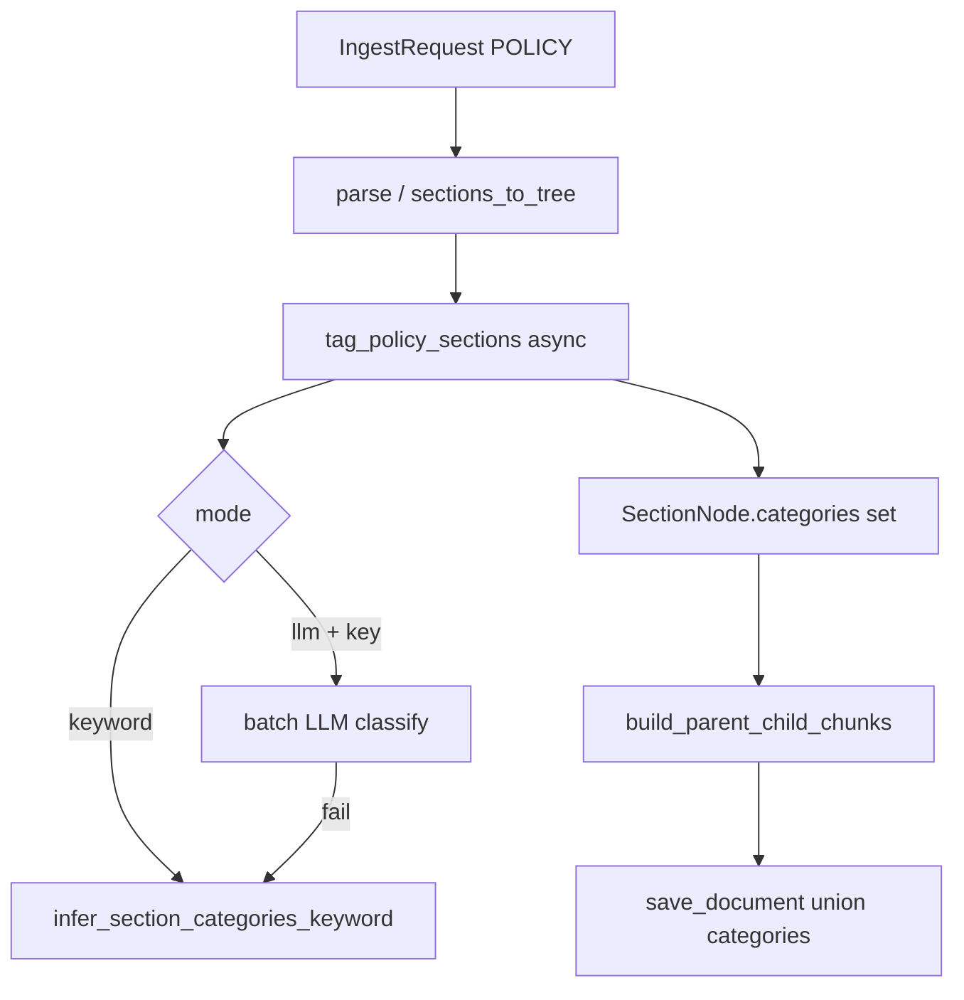

# Phase 37C — Per-Parent Category Tagging at Ingest

**Status:** COMPLETE  
**Plan ID:** `DR-PHASE-37C-CATEGORY-TAGGER`  
**Priority:** P0  
**Scope:** `document_core` only — tagger service, ingest wire-up, parent metadata, tests  
**Estimated diff:** ~350–450 LOC (mostly new tagger + tests)  
**Depends on:** Phase 37A (complete), Phase 37B (complete)  
**Non-goals:** Java sending categories, per-child tags, `review_agent` imports, retrieval changes (Phase 35A)

---

## 1. Goal

After `parse_text_to_tree`, **Python assigns categories per parent section** on policy ingest. Java sends raw `text` only.

```
policy text → parse_text_to_tree
           → tag_policy_sections()     # 1–3 categories per parent
           → build_parent_child_chunks  # per-parent metadata.categories
           → save_document              # document union in policy_documents row
```

**Review** still classifies **contract** sections at runtime; **policy** sections are pre-tagged at ingest for retrieval filters.

---

## 2. Minimal-change strategy

| Do | Don't |
|----|-------|
| New `category_tagger.py` + small LLM helper in `document_core` | Import `review_agent` (circular dep) |
| Add `categories: list[str]` on `SectionNode` | New ingest API fields from Java |
| Per-parent metadata in `parent_child.py` | Per-child different categories |
| Keyword fallback (existing phrases) when LLM off/fails | Duplicate full `section_category_lexical.py` |
| Union categories in `save_document` (5 lines) | New DB columns |
| Tests with `category_tagger_mode=keyword` in CI | Live LLM in unit tests |

**Single PR:** `phase-37c-per-parent-category-tagger`

---

## 3. Architecture



| Layer | Responsibility |
|-------|----------------|
| `SectionNode.categories` | Per-section tags before chunking |
| Parent `IndexedChunk.metadata.categories` | Same tags on parent + children for that section |
| `policy_documents.metadata.categories` | **Union** of all section tags (discovery filter) |
| `metadata.auto_tagged` | `true` |
| `metadata.tagger` | `"llm"` \| `"keyword"` |

---

## 4. Current state (gap)

File: `ingest.py` L44–61

| Today | Gap |
|-------|-----|
| Document-level keyword infer from title + first 3 sections | No per-section tags |
| Same `meta` on every parent/child chunk | Retrieval cannot match section-level policy clauses |
| `resolve_ingest_categories(provided=None)` | Whole-document only |
| No LLM in `document_core` | Need tiny OpenAI-compatible client |

---

## 5. Implementation order

```
Step 1  Schemas: SectionNode.categories + category tag Pydantic models
Step 2  keyword: infer_section_categories_keyword() in metadata_at_ingest
Step 3  category_tagger.py (batch LLM + fallback)
Step 4  document_core/llm/ingest_llm.py (minimal structured call)
Step 5  config + .env.example
Step 6  parent_child per-parent metadata
Step 7  ingest.py wire (policies only)
Step 8  save_document category union
Step 9  tests (keyword mode + mocked LLM)
```

---

## 6. Task detail

### 37C.2 — Taxonomy (no code change)

Use existing `STANDARD_POLICY_CATEGORIES` + `normalize_categories()` from `document_core/schemas/taxonomy.py`.

LLM prompt must list allowed labels (sorted, exclude `general` from prompt; add `general` only as fallback).

Export helper for prompt:

```python
def taxonomy_prompt_labels() -> str:
    labels = sorted(STANDARD_POLICY_CATEGORIES - {"general"})
    return ", ".join(labels)
```

| LOC | ~8 in `taxonomy.py` |

---

### 37C.1 + 37C.3 + 37C.4 — `category_tagger.py`

**New file:** `document_core/services/category_tagger.py`

**New schema:** `document_core/schemas/category_tag.py`

```python
class SectionCategoryTag(BaseModel):
    section_id: str
    categories: list[str] = Field(default_factory=list, max_length=3)

class BatchSectionCategoryTagResult(BaseModel):
    items: list[SectionCategoryTag] = Field(default_factory=list)
```

**New prompt:** `document_core/prompts/policy_section_categories.md`

```markdown
## SYSTEM
You tag legal policy sections with taxonomy labels. Return JSON only.
Allowed categories: {taxonomy_labels}
Assign 1–3 categories per section. Use exact label strings only.

## USER
Document title: {document_title}

Sections:
{sections_block}

Return: {"items": [{"section_id": "...", "categories": ["..."]}]}
```

`sections_block` format per section (truncate body to `category_tagger_max_section_chars`, default 1200):

```
- section_id: 4 | title: Limitation of Liability
  text: Vendor liability shall not exceed...
```

**Core API:**

```python
async def tag_policy_sections(
    tree: DocumentTree,
    *,
    document_title: str,
    settings: DocumentCoreSettings | None = None,
) -> tuple[DocumentTree, dict[str, object]]:
    """Walk tree.sections (+ children), set node.categories, return extra metadata."""
```

**Batching (37C.4):** Flatten all parent `SectionNode`s (DFS). Chunks of `category_tagger_batch_size` (default 8). One LLM call per batch.

**Validation:** Map LLM output through `normalize_categories()`; drop unknown labels; if empty → keyword fallback for that section.

| LOC | ~120 |

---

### 37C.11 — LLM client (minimal, no review_agent)

**New file:** `document_core/llm/ingest_llm.py`

Mirror env vars already used by review agent (same deployment):

| Env | Default |
|-----|---------|
| `LLM_API_KEY` or `MISTRAL_API_KEY` | — |
| `LLM_BASE_URL` | provider default |
| `CATEGORY_TAGGER_MODEL` | `mistral-small-latest` or same as `COMPLIANCE_LLM_MODEL` |

```python
async def invoke_structured_json(
    *,
    model: str,
    system: str,
    user: str,
    schema: type[BaseModel],
    temperature: float = 0.0,
) -> BaseModel:
```

Use `langchain.chat_models.init_chat_model` **only if** already a transitive dep of `document_core`; else `httpx` POST to `/v1/chat/completions` with `response_format: json_object` (~60 LOC).

**No** circuit breaker / rate limiter in 37C (ingest is batch, not review hot path). Log warning on failure → keyword fallback.

| LOC | ~60–80 |

---

### 37C.8 — Keyword fallback

**File:** `document_core/services/metadata_at_ingest.py`

Refactor existing `_infer_categories` → public:

```python
def infer_section_categories_keyword(*, title: str, text: str) -> list[str]:
    """Per-section keyword/phrase infer; returns 1+ categories or ['general']."""
```

Keep `resolve_ingest_categories()` for backward compat but **stop calling from ingest** for policies (or make it delegate to keyword union for non-tagger paths).

| LOC | ~15 refactor |

---

### 37C.5 + 37C.12 — Wire ingest

**File:** `document_core/schemas/chunk.py`

```python
class SectionNode(BaseModel):
    ...
    categories: list[str] = Field(default_factory=list)
```

**File:** `document_core/services/ingest.py`

Replace policy block L44–61 with:

```python
extra_meta: dict[str, object] = {}
if request.kind == DocumentKind.POLICY:
    settings = get_settings()
    if settings.category_tagger_enabled:
        tree, extra_meta = await tag_policy_sections(
            tree, document_title=request.title, settings=settings,
        )
    else:
        # keyword-only fallback for all sections
        _apply_keyword_tags_to_tree(tree, document_title=request.title)
        extra_meta = {"auto_tagged": True, "tagger": "keyword"}
elif request.kind == DocumentKind.CONTRACT:
    pass  # 37C.12: no ingest tagging for contracts
```

Remove document-level-only `resolve_ingest_categories` call for policies.

Optional warning:

```python
if request.kind == DocumentKind.POLICY and all(
    c == ["general"] for c in _all_section_categories(tree)
):
    warnings.append("all sections tagged general; check parser or enable LLM tagger")
```

| LOC | ~25 |

---

### 37C.6 — Per-parent chunk metadata

**File:** `document_core/indexer/parent_child.py`

Change walk loop:

```python
section_meta = {**meta, "categories": list(node.categories or [])}
parent = IndexedChunk(..., metadata=section_meta)
children.append(IndexedChunk(..., metadata=section_meta))
```

`meta` (base) has `document_title`, `auto_tagged`, `tagger`, `policy_ref` — **not** document-level `categories` (union computed at save).

| LOC | ~8 |

---

### 37C.7 — Document-level union

**File:** `document_core/store/pgvector_store.py` — `save_document` (~L103)

Before `compute_content_hash` / INSERT:

```python
def _document_categories(parents: list[IndexedChunk]) -> list[str]:
    from document_core.schemas.taxonomy import normalize_categories
    raw: list[str] = []
    for parent in parents:
        cats = (parent.metadata or {}).get("categories")
        if isinstance(cats, list):
            raw.extend(str(c) for c in cats)
    return normalize_categories(raw) or ["general"]

doc_categories = _document_categories(parents)
metadata = dict(parents[0].metadata if parents else {})
metadata["categories"] = doc_categories
```

Use `metadata` (with union) for `policy_documents` row and content hash `categories` key.

Per-chunk rows keep **section-level** `metadata.categories` unchanged.

| LOC | ~15 |

---

### 37C.9 — Observability fields

Set in `tag_policy_sections` return `extra_meta`:

```python
{"auto_tagged": True, "tagger": "llm"}  # or "keyword"
```

Merge into base `meta` in ingest (already pattern from 37A).

---

### 37C.11 — Config

**File:** `document_core/config.py`

```python
category_tagger_enabled: bool = True
category_tagger_mode: Literal["auto", "llm", "keyword"] = "auto"
# auto = try LLM if API key present, else keyword
category_tagger_model: str = "mistral-small-latest"
category_tagger_batch_size: int = 8
category_tagger_max_section_chars: int = 1200
category_tagger_temperature: float = 0.0
```

**File:** `document_core/.env.example`

```env
CATEGORY_TAGGER_ENABLED=true
CATEGORY_TAGGER_MODE=auto
CATEGORY_TAGGER_MODEL=mistral-small-latest
CATEGORY_TAGGER_BATCH_SIZE=8
```

| LOC | ~20 |

---

### 37C.10 — Tests

**New file:** `document_core/tests/test_category_tagger.py`

| Test | Mode | Assert |
|------|------|--------|
| `test_keyword_tags_liability_section` | `keyword` | title "Limitation of Liability" → `["liability"]` |
| `test_keyword_tags_confidentiality` | `keyword` | → `["confidentiality"]` |
| `test_keyword_tags_indemnity` | `keyword` | → `["indemnity"]` |
| `test_ingest_policy_per_parent_categories` | `keyword` | ingest SAMPLE_POLICY → parents have distinct categories |
| `test_document_union_categories` | `keyword` | policy_documents metadata includes `liability` + `indemnity` |
| `test_llm_batch_mocked` | mock `invoke_structured_json` | returns batch → nodes tagged |
| `test_llm_fallback_to_keyword` | mock raises | still get valid categories |

Use `SAMPLE_POLICY` from `tests/fixtures.py`. For NDA-style multi-section policy, add `tests/fixtures/sample_nda_policy.txt` (minimal 4-section playbook) or flatten acme sections **policy-only subset** (sections 3,6,7,9).

**conftest / test setup:**

```python
monkeypatch.setenv("CATEGORY_TAGGER_MODE", "keyword")
get_settings.cache_clear()
```

Update `test_ingest_auto_tags_policy` in `test_ingest_search.py` if it expects document-level only — assert per-parent `metadata.categories` on `get_parents()`.

| LOC | ~150 |

---

## 7. NDA mapping (acceptance reference)

| Section title (policy playbook) | Expected category |
|--------------------------------|-------------------|
| Confidential Information | `confidentiality` |
| Limitation of Liability | `liability` |
| Indemnification / Defense and Indemnification | `indemnity` |
| Term / Termination | `termination` |
| No License / IP | `ip` |
| Governing Law | `governing_law` |

**Acceptance test:** ingest 4-section policy raw text (keyword or mocked LLM) → ≥4 parents, each with expected category; `list_document_ids_by_categories(tenant, ["liability"])` returns document id.

---

## 8. File checklist

| File | Action |
|------|--------|
| `schemas/chunk.py` | `SectionNode.categories` |
| `schemas/category_tag.py` | **new** |
| `schemas/taxonomy.py` | `taxonomy_prompt_labels()` |
| `prompts/policy_section_categories.md` | **new** |
| `llm/ingest_llm.py` | **new** |
| `services/category_tagger.py` | **new** |
| `services/metadata_at_ingest.py` | per-section keyword extract |
| `services/ingest.py` | wire tagger, skip contracts |
| `indexer/parent_child.py` | per-parent metadata |
| `store/pgvector_store.py` | document union |
| `config.py` + `.env.example` | settings |
| `tests/test_category_tagger.py` | **new** |

**Do not modify:** `review_agent/**`, Java, `list_document_ids_by_categories` SQL (already uses `policy_documents.metadata.categories`).

---

## 9. Acceptance criteria

| # | Criterion |
|---|-----------|
| AC1 | Policy ingest sets **different** `metadata.categories` on liability vs indemnity parents |
| AC2 | `policy_documents.metadata.categories` = union of section tags |
| AC3 | Contract ingest unchanged (no `auto_tagged` from tagger) |
| AC4 | `CATEGORY_TAGGER_MODE=keyword` works with no API key (CI) |
| AC5 | `CATEGORY_TAGGER_MODE=auto` + no key → keyword, no crash |
| AC6 | LLM failure → keyword fallback per section |
| AC7 | `metadata.tagger` + `metadata.auto_tagged` set on policy ingest |
| AC8 | All `document_core` unit tests pass |

---

## 10. Risk & rollback

| Risk | Mitigation |
|------|------------|
| LLM latency on large playbooks | Batch size 8; truncate section text; ingest async already |
| Wrong LLM labels | `normalize_categories` + allowlist filter |
| `content_hash` changes when categories change | Expected — re-index updates embeddings path correctly |
| Duplicate taxonomy with review classifier | Same `taxonomy.py` labels; drift tested in 37C.10 |
| `parents[0]` metadata assumption | Union helper in `save_document` fixes document row |

**Rollback:** `CATEGORY_TAGGER_ENABLED=false` → keyword per-section or disable tagging entirely via flag.

---

## 11. Effort estimate

| Step | Hours |
|------|-------|
| Schemas + keyword refactor | 1–2h |
| category_tagger + prompt + LLM client | 3–4h |
| parent_child + ingest + save union | 1–2h |
| Tests | 2–3h |
| **Total** | **1.5–2 dev days** |

---

## 12. Out of scope (Phase 35A follow-up)

| Item | Phase |
|------|-------|
| `list_document_ids_by_categories` match **per parent chunk** | 35A |
| Boost retrieval by section category alignment | 35A |
| Remove `categories` field from `IngestRequest` entirely | optional cleanup |
| Contract ingest tagging | not planned |

---

## 13. PR description template

```
Phase 37C: per-parent policy category tagging at ingest

- tag_policy_sections (LLM batch + keyword fallback)
- SectionNode.categories → per-parent chunk metadata
- policy_documents.metadata.categories = union
- CATEGORY_TAGGER_* config; contracts skipped
- tests: keyword mode + mocked LLM
```
