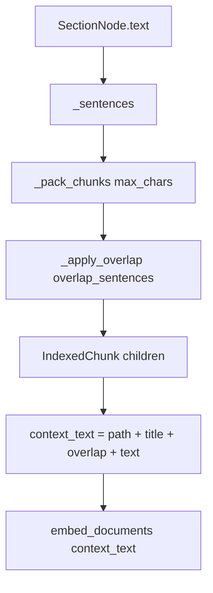

# Phase 37D — Chunking Quality for Retrieval

**Status:** COMPLETE  
**Plan ID:** `DR-PHASE-37D-CHUNKING-QUALITY`  
**Priority:** P0  
**Scope:** `document_core` only — `parent_child.py`, ingest warnings, `content_hash` bump, unit tests  
**Estimated diff:** ~120–180 LOC (mostly `parent_child.py` + tests)  
**Depends on:** Phase 37B (parser, complete), Phase 37C (per-parent categories, complete)  
**Non-goals:** Java API changes, embedding model swap, hybrid search tuning (Phase 35), review-time chunking

---

## 1. Goal

After sections exist (37B) and categories are assigned (37C), **child chunks must be sized and overlapped for good vector retrieval** — especially long liability/indemnity clauses split across multiple embeddable units without mid-sentence breaks.

```
sections + categories → build_parent_child_chunks
                      → sentence-pack children (≤700 chars)
                      → overlap last 1–2 sentences in context_text
                      → embed context_text (unchanged path)
                      → save_document (content_hash skip if unchanged)
```

**Success:** A 1,500-char liability paragraph yields **≥2 children**, second child’s `context_text` includes overlap from the first, and re-ingest after deploy re-embeds when chunk policy changes.

---

## 2. Progress today (~35%)

| ID | Task | Status | Evidence |
|----|------|--------|----------|
| **37D.1** | Child max size ~600–800 | **Not done** | Paragraphs `<400` kept whole; sentences emitted one-by-one with no max packing |
| **37D.2** | Sentence-boundary split | **Partial** | `_SENTENCE_SPLIT` only when `len(para) >= 400`; short multi-sentence paras unsplit |
| **37D.3** | Overlap 1–2 sentences | **Not done** | No overlap between consecutive children |
| **37D.4** | Empty section guard | **Not done** | Empty `node.text` still creates parent + `[""]` child |
| **37D.5** | Embed `context_text` | **Done** | `pgvector_store.py` L155: `embed_documents([c.context_text or c.text ...])` |
| **37D.6** | Re-index content hash skip | **Done** | `content_hash()` + `test_reingest_unchanged_content_skips_embedding` |
| **37D.7** | Chunking unit tests | **Not done** | No `test_parent_child.py` |

**Remaining work:** 37D.1–37D.4, 37D.7, plus **37D.6b** (chunk-version in hash — see §6.6).

---

## 3. Minimal-change strategy

| Do | Don't |
|----|-------|
| Refactor `_split_child_units` → pack sentences up to `max_chars` | New chunking service / file unless logic exceeds ~100 LOC |
| Overlap only in `context_text` (keep `text` clean for citations) | Duplicate overlap in `text` and DB storage |
| Skip zero-length parents in `walk()` | New DB columns |
| 2 config knobs + `chunk_version` in hash | Per-tenant chunk profiles |
| Pure unit tests on `_split_child_chunks()` | Integration tests requiring Postgres for chunk shape |
| Document Java “resend on edit” (no code) | Java sync changes in this phase |

**Single PR:** `phase-37d-chunking-quality`

---

## 4. Architecture



| Field | Purpose |
|-------|---------|
| `child.text` | Exact chunk body (no overlap duplicate) |
| `child.context_text` | `{section_path} > {title}\n{overlap_prefix}{text}` — **embedded** |
| `parent.text` | Full section body (unchanged) |
| `metadata.chunk_version` | Bumps `content_hash` when chunk policy changes |

---

## 5. Current state (gap)

File: `parent_child.py` L81–93

```python
def _split_child_units(text: str) -> list[str]:
    paragraphs = [p.strip() for p in text.split("\n\n") if p.strip()]
    ...
    for para in paragraphs:
        if len(para) < 400:
            units.append(para)          # ← can be 400+ chars, multi-sentence blob
            continue
        sentences = _SENTENCE_SPLIT.split(para)
        units.extend(sentences)         # ← one sentence = one child (no max pack)
    return units or [text.strip()]      # ← empty text → [""]
```

| Problem | Retrieval impact |
|---------|------------------|
| No max packing | Tiny children (1 sentence) or huge children (whole short para) |
| No overlap | Boundary queries miss context at chunk edges |
| Empty sections indexed | Noise in parent list; wasted embed slots |
| Hash ignores chunk policy | Deploy 37D without text change → **skip re-embed** (stale vectors) |

---

## 6. Implementation order

```
Step 1  Config: child_chunk_max_chars, child_chunk_overlap_sentences
Step 2  parent_child: _sentences → _pack_chunks → _split_child_chunks
Step 3  parent_child: overlap in context_text only (build loop)
Step 4  parent_child: skip empty section parents
Step 5  ingest: empty-section warnings + chunk_version in meta
Step 6  content_hash: include chunk_version in fingerprint
Step 7  tests/test_parent_child.py
Step 8  Verify 37D.5 + 37D.6 unchanged (grep + existing test)
```

---

## 7. Task detail

### 37D.1 — Child max size (~700 chars default)

**File:** `document_core/indexer/parent_child.py`

Replace ad-hoc 400-char paragraph rule with **sentence packing**:

```python
def _pack_chunks(sentences: list[str], *, max_chars: int) -> list[str]:
    """Greedy pack: add sentences until next would exceed max_chars."""
    if not sentences:
        return []
    chunks: list[str] = []
    current: list[str] = []
    current_len = 0
    for sent in sentences:
        add_len = len(sent) + (1 if current else 0)
        if current and current_len + add_len > max_chars:
            chunks.append(" ".join(current))
            current = [sent]
            current_len = len(sent)
        else:
            current.append(sent)
            current_len += add_len
    if current:
        chunks.append(" ".join(current))
    return chunks
```

| Default | Range | Config key |
|---------|-------|------------|
| `700` | 600–800 | `CHILD_CHUNK_MAX_CHARS` |

**Oversized single sentence** (`len(sent) > max_chars`): split on last space before `max_chars`; if no space, hard-cut at `max_chars`. No mid-word split when space exists.

| LOC | ~35 |

---

### 37D.2 — Sentence-boundary split (always)

**File:** `document_core/indexer/parent_child.py`

Keep existing regex; apply to **all** paragraph text before packing (not only `len(para) >= 400`):

```python
_SENTENCE_SPLIT = re.compile(r"(?<=[.!?])\s+(?=[A-Z(\"\'])")

def _sentences_from_text(text: str) -> list[str]:
    paragraphs = [p.strip() for p in text.split("\n\n") if p.strip()]
    out: list[str] = []
    for para in paragraphs:
        parts = [s.strip() for s in _SENTENCE_SPLIT.split(para) if s.strip()]
        out.extend(parts if len(parts) > 1 else [para])
    return out
```

**Note:** Legal enumerations `(a)`, `(i)` may stay attached to prior sentence — acceptable for v1; do not add NLP deps.

Public entry:

```python
def _split_child_chunks(
    text: str,
    *,
    max_chars: int = 700,
) -> list[str]:
    sents = _sentences_from_text(text.strip())
    if not sents:
        return []
    # expand oversized sentences before pack
    ...
    return _pack_chunks(expanded, max_chars=max_chars)
```

Remove `_split_child_units` (inline callers only).

| LOC | ~25 refactor |

---

### 37D.3 — Overlap (last 1–2 sentences in `context_text`)

**File:** `parent_child.py` — child build loop (L54–72)

Do **not** duplicate overlap in `child.text`. Only prefix overlap when building `context_text`:

```python
chunks = _split_child_chunks(node.text, max_chars=settings.child_chunk_max_chars)
overlap_n = settings.child_chunk_overlap_sentences  # default 2

prev_sents: list[str] = []
for idx, child_text in enumerate(chunks):
    overlap_prefix = ""
    if idx > 0 and overlap_n > 0:
        prev_sents = _sentences_from_text(chunks[idx - 1])
        tail = prev_sents[-overlap_n:]
        if tail:
            overlap_prefix = " ".join(tail) + " "
    context = f"{path} > {node.title}\n{overlap_prefix}{child_text}".strip()
    ...
```

| Default | Config key |
|---------|------------|
| `2` sentences | `CHILD_CHUNK_OVERLAP_SENTENCES` (0 = disable) |

**First child:** no overlap. **Embedding** uses `context_text` (37D.5) — overlap improves boundary recall without polluting grounded quotes from `text`.

| LOC | ~15 |

---

### 37D.4 — Empty section guard

**File:** `parent_child.py` — top of `walk` body:

```python
if not node.text.strip():
    walk(node.children, path)  # still descend
    return
```

**File:** `ingest.py` — after `build_parent_child_chunks`:

```python
section_count = sum(1 for _ in _iter_sections(tree.sections))  # import _iter_sections from category_tagger OR local 4-line helper
if section_count > len(parents):
    skipped = section_count - len(parents)
    warnings.append(f"skipped {skipped} empty section(s); no parent chunks created")
```

**Minimal alternative:** return `skipped_empty: int` from `build_parent_child_chunks` tuple — avoids importing tree walker in ingest:

```python
return parents, children, skipped_empty
```

Prefer **return counter** (3-tuple) — 1 call site, no cross-module import.

| LOC | ~12 |

---

### 37D.5 — Embed `context_text` (verify only)

**No code change.** Confirm these lines remain:

| File | Line | Behavior |
|------|------|----------|
| `pgvector_store.py` | `child_texts = [c.context_text or c.text for c in children]` | Embeds context |
| `pgvector_store.py` | `to_tsvector(..., COALESCE(:context_text, :text))` | Lexical index uses context |
| `search.py` | `score_query(..., child.context_text or child.text)` | Lexical search |

**Test:** add assertion in `test_parent_child.py` that built chunk has `context_text` containing `section_path` and `title`.

| LOC | 0 (+ ~5 in test) |

---

### 37D.6 — Re-index / content hash (exists + bump)

**Exists:** `content_hash(canonical_text, {categories, policy_type})` → skip embed when unchanged (`test_reingest_unchanged_content_skips_embedding`).

**37D.6b — Chunk policy version (required for deploy):**

**File:** `content_hash.py`

```python
_HASH_METADATA_KEYS = frozenset({"categories", "policy_type", "chunk_version"})
```

**File:** `ingest.py` — in base `meta`:

```python
meta = {
    **request.metadata,
    "document_title": request.title,
    "chunk_version": 2,  # bump when chunk algorithm changes
    **extra_meta,
}
```

Effect: first ingest after 37D deploy **re-embeds** even if Java sends identical text. Java behavior unchanged — resend same `document_id` on edit already triggers re-index when text changes.

| LOC | ~5 |

---

### 37D.7 — Tests

**New file:** `document_core/tests/test_parent_child.py`

| Test | Assert |
|------|--------|
| `test_long_liability_splits_into_multiple_children` | ~1,500-char liability fixture → `len(children) >= 2` |
| `test_chunks_respect_max_size` | each `len(c.text) <= max_chars + 50` (slack for oversized sentence fallback) |
| `test_no_mid_sentence_split` | split points align with `.!?` boundaries (regex spot-check) |
| `test_overlap_in_context_not_text` | child[1].`text` ⊄ child[0].`text`; child[1].`context_text` contains tail of child[0] |
| `test_empty_section_skipped` | tree with empty + non-empty sections → 1 parent, warning counter |
| `test_context_text_includes_path_and_title` | `path` and `title` in `context_text` |
| `test_chunk_version_in_metadata` | ingest meta contains `chunk_version: 2` |

**Fixture** (inline in test file, ~600 chars × 3 sentences):

```python
LONG_LIABILITY = (
    "The total liability of Vendor under this Agreement shall not exceed "
    "the fees paid in the twelve (12) months preceding the claim. "
    # ... repeat / extend to ~1500 chars with variants ...
)
```

**No Postgres** for 37D.7 — call `build_parent_child_chunks` directly.

Update `test_pgvector_save_document.py` only if `build_parent_child_chunks` return type becomes 3-tuple (unpack `parents, children, _`).

| LOC | ~100 |

---

### 37D.8 — Config

**File:** `document_core/config.py`

```python
child_chunk_max_chars: int = 700
child_chunk_overlap_sentences: int = 2
```

**File:** `document_core/.env.example`

```env
# Phase 37D — child chunk sizing for embeddings
CHILD_CHUNK_MAX_CHARS=700
CHILD_CHUNK_OVERLAP_SENTENCES=2
```

`build_parent_child_chunks` accepts optional `settings: DocumentCoreSettings | None` OR reads `get_settings()` inside `_split_child_chunks` call — **minimal:** read settings once at start of `build_parent_child_chunks`.

| LOC | ~12 |

---

## 8. File checklist

| File | Action |
|------|--------|
| `indexer/parent_child.py` | **main** — pack, overlap, empty skip, 3-tuple return |
| `config.py` | `child_chunk_*` settings |
| `.env.example` | document vars |
| `services/ingest.py` | `chunk_version`, empty-section warning |
| `store/content_hash.py` | `chunk_version` in fingerprint |
| `tests/test_parent_child.py` | **new** |
| `tests/test_pgvector_save_document.py` | unpack 3-tuple if needed |

**Do not modify:** `pgvector_store` embed path, Java ingest API, `review_agent/**`, embedding model.

---

## 9. Acceptance criteria

| # | Criterion |
|---|-----------|
| AC1 | Liability clause ≥1,400 chars → **≥2** children under one parent |
| AC2 | No child `text` splits mid-sentence when sentence boundaries exist |
| AC3 | Each child `text` length ≤ `CHILD_CHUNK_MAX_CHARS` (+ slack for single oversize sentence) |
| AC4 | Child index ≥1: `context_text` contains last 1–2 sentences of previous child; `text` does not |
| AC5 | Empty `SectionNode.text` → no parent/children; ingest warning mentions skip count |
| AC6 | `context_text` format `{path} > {title}\n{body}` unchanged for child 0 |
| AC7 | `embed_documents` still receives `context_text` (37D.5) |
| AC8 | Re-ingest unchanged text **after** 37D with same `chunk_version` skips embed (37D.6) |
| AC9 | Re-ingest with `chunk_version` bump (or first post-deploy ingest) re-embeds |
| AC10 | All `document_core` unit tests pass (`pytest tests/ -m "not integration"`) |

---

## 10. Risk & rollback

| Risk | Mitigation |
|------|------------|
| More children → slower ingest embed | Max 700 chars caps count; typical section 2–4 children |
| Overlap inflates embed input | Only 1–2 sentences (~100–300 chars); cap `overlap_sentences` at 2 |
| `chunk_version` forces mass re-embed on deploy | One-time cost; expected for quality fix |
| Sentence regex misses legal lists | v1 acceptable; log `structure_confidence=low` already |
| 3-tuple return breaks callers | Only `ingest.py` + 1 test file |

**Rollback:** set `CHILD_CHUNK_MAX_CHARS=10000`, `CHILD_CHUNK_OVERLAP_SENTENCES=0` — approximates old behavior; or revert PR.

---

## 11. Effort estimate

| Step | Hours |
|------|-------|
| `_split_child_chunks` + pack + oversize fallback | 2–3h |
| Overlap + empty skip + ingest warnings | 1–2h |
| Config + chunk_version hash | 0.5h |
| Unit tests | 2–3h |
| **Total** | **1–1.5 dev days** (not 3–4; ~35% already done) |

---

## 12. Out of scope

| Item | Phase |
|------|-------|
| Semantic / LLM chunking | future |
| Per-category chunk sizes | future |
| Parent chunk embedding | not planned (children only) |
| Hybrid alpha / reranker | Phase 35 |
| Java chunk metadata | never (Python owns chunking) |

---

## 13. Java / ops note (37D.6)

No Java code in this phase. **Operational contract** (document only):

- On policy edit: Java resends `POST /tools/index_policy` with same `document_id` and updated `text` → new `canonical_text` → new hash → re-embed.
- On 37D deploy: `chunk_version: 2` in metadata forces re-embed on next resend even if text unchanged (one-time).

---

## 14. PR description template

```
Phase 37D: child chunk quality for retrieval

- sentence-pack children to CHILD_CHUNK_MAX_CHARS (default 700)
- overlap last N sentences in context_text only
- skip empty sections + ingest warning
- chunk_version in content_hash for deploy re-embed
- tests: long liability → 2+ children, overlap present
```
