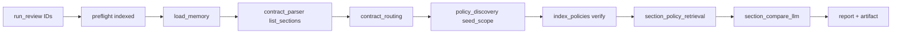

# Phase 38 — Review Agent Alignment

**Status:** COMPLETE  
**Plan ID:** `DR-PHASE-38-REVIEW-AGENT-ALIGNMENT`  
**Priority:** P1  
**Scope:** `review_agent`, `legal_ai_platform` review path, E2E tests, artifact/report observability  
**Estimated diff:** ~120–180 LOC (mostly tests + small artifact/report wiring)  
**Depends on:** Phase 36 (ID-only scope), Phase 37A (no `applies_to_contract_types`), Phase 35 (retrieval), Phase 37C (per-parent categories)  
**Non-goals:** New graph nodes, Java sync rewrite, auto-discovery without `policy_document_ids`

---

## 1. Goal

Review pipeline is **aligned** with production contract:

```
Java → index contract + policies (raw text)
     → review API: contract_document_id + policy_document_ids[]
     → load sections from DB → classify → retrieve → compare → report + artifact
```

No inline policies, no contract-type policy filtering, no re-parse of contract at review time.

---

## 2. Progress (100%)

| ID | Task | Status | Evidence |
|----|------|--------|----------|
| **38.1** | `contract_document_id` + `policy_document_ids` required | ✅ **Done** | `review_inputs.py` L16–21; `discovery_nodes.py` L52–53; `legal_ai_platform/orchestrator.py` L153–163 |
| **38.2** | Load sections from DB (no re-parse) | ✅ **Done** | `contract_parser_node` → `client.list_sections` (`nodes.py` L38–46); warning `"loaded existing contract by document_id"` |
| **38.3** | Routing → `contract_type` for compare context only | ✅ **Done** | `contract_routing_node` sets `contract_type`; passed to `classify_all_sections`, `multi_retrieve_for_section`, `section_compare_llm` — **not** used to filter scoped policies |
| **38.4** | Per-section classify → retrieval categories | ✅ **Done** | `section_retrieval_nodes.py` L42–46 → `multi_retrieve_for_section` |
| **38.5** | multi_retrieval → rerank → compare → report | ✅ **Done** | Graph: `section_policy_retrieval` → `section_compare_llm` → `merge` → `report` (`review_graph.py`) |
| **38.6** | Remove `applies_to_contract_types` from compare/routing filters | ✅ **Done** | `test_no_contract_type_policy_filter.py`; `rg applies_to_contract_types review_agent` → **0** hits |
| **38.7** | NDA E2E with acme fixtures + mocked/real LLM | ✅ **Done** | `tests/test_acme_nda_e2e.py`, `tests/fixtures/acme_nda_*.json`, `tests/acme_fixtures.py` |
| **38.8** | Zero-hit / degraded metrics in report artifact | ✅ **Done** | `zero_hit_failed_entry`, `ops.degraded_section_count`, `ops.retrieval_zero_hit_section_ids`, markdown ops rows |
| **38.9** | Prod env alignment | ✅ **Done** | `.env.production.example` → `REVIEW_POLICY_SCOPE=request` |

**Remaining:** none.

---

## 3. Architecture (locked)



| Input | Source | Review use |
|-------|--------|--------------|
| `contract_document_id` | Java ingest | `list_sections(CONTRACT)` — parents from index |
| `policy_document_ids[]` | Java ingest scope | `seed_discovered_from_scope` — no topic discovery cap |
| `contract_type` | Request or routing LLM | Classifier hint + compare prompt only |
| Policy categories | Ingest 37C on parent chunks | Retrieval filter/boost (Phase 35) |

**Explicit non-behavior:** `discovery_contract_type_filter` does **not** affect scoped review graph (discovery node never calls `discover_policies_from_topics`). Config flag only matters for legacy/auto-discovery callers.

---

## 4. Root cause — why 38.7 / 38.8 are partial

| Gap | Root cause | Symptom |
|-----|------------|---------|
| **G1** | E2E uses minimal `SAMPLE_*` fixtures, not acme NDA shape | No regression for 10-section NDA + multi-policy playbook IDs |
| **G2** | `failed_sections` only records classify LLM-down, retrieval **exception**, compare fail — not empty hits | `retrieval_zero_hit_sections > 0` but `degraded_sections` empty |
| **G3** | Markdown report ops table omits degraded list/count | Ops sees zero-hit number, not **which** sections |
| **G4** | `.env.production.example` has `REVIEW_POLICY_SCOPE=discovered` while code default is `request` | Deploy confusion (graph still requires `policy_document_ids`) |

---

## 5. Minimal-change strategy

| Do | Don't |
|----|-------|
| Add **one** acme NDA integration test file | Duplicate full temp_java_sync harness in review_agent |
| Copy minimal acme fixture subset into `review_agent/tests/fixtures/` | Cross-package path to `temp_java_sync/` |
| Add `zero_hit_failed_entry` + merge in retrieval node (~8 LOC) | New observability subsystem |
| Add `degraded_section_count` to `ReviewArtifactOps` + report row (~15 LOC) | Prometheus in 38 (defer to 31 T4) |
| Grep CI guard for `applies_to_contract_types` in review_agent | DB migration to drop column |
| Fix prod env example `REVIEW_POLICY_SCOPE=request` | Rewrite policy_discovery |

**Single PR:** `phase-38-review-alignment-tests-ops`

---

## 6. Implementation order

```
Step 1  38.6  CI grep guard + doc (verify only)
Step 2  38.8  zero-hit → failed_sections + ops fields + report rows
Step 3  38.7  acme NDA E2E test (fixtures + seed + mocked compare)
Step 4  38.8  artifact/report unit tests
Step 5  Env   REVIEW_POLICY_SCOPE=request in prod example
```

---

## 7. Task detail

### 38.6 — Verify `applies_to_contract_types` removed (37A carryover)

**Status:** Runtime clean in `review_agent`. **Task:** prevent regression.

**New test** — `review_agent/tests/test_no_contract_type_policy_filter.py`:

```python
import subprocess

def test_review_agent_has_no_applies_to_contract_types():
    result = subprocess.run(
        ["rg", "applies_to_contract_types", "review_agent", "--glob", "*.py"],
        capture_output=True, text=True, cwd=REPO_ROOT,
    )
    assert result.returncode == 1, result.stdout  # no matches
```

**Platform:** same grep on `legal_ai_platform/src` (optional single test).

| LOC | ~20 |
| Action | Document only — no code paths to change |

---

### 38.7 — NDA E2E with acme fixtures

**New fixtures** (copy subset — avoid `temp_java_sync` import path):

| File | Content |
|------|---------|
| `review_agent/tests/fixtures/acme_nda_contract.json` | Sections 3,6,7 from `acme_cloudvendor_nda.json` OR full 10 sections |
| `review_agent/tests/fixtures/acme_nda_policies.json` | `ms_liability`, `ms_indemnity` policy texts from `temp_java_sync/fixtures/acme_nda/policies/` |

**Helper** — `tests/acme_fixtures.py`:

```python
def acme_contract_sections() -> list[IngestSectionInput]: ...
def acme_policy_texts() -> dict[str, str]:  # ref → text
```

**New test** — `review_agent/tests/test_acme_nda_e2e.py` (`@pytest.mark.integration`):

1. Tenant `acme-nda-test`
2. Register + **structured ingest** contract from acme sections (or raw text if parser golden enough)
3. Ingest `ms_liability` + `ms_indemnity` policies (`kind=POLICY`)
4. `run_review(contract_document_id, policy_document_ids=[liability_id, indemnity_id])`
5. **Mocks:** `section_compare_llm.invoke_structured` only (classifier **lexical_first** real)
6. **Assert:**
   - `compliance_stats.retrieval_zero_hit_sections == 0` (substantive sections)
   - Section `6` bundle: top hit parent `metadata.categories` contains `liability`
   - Section `7` bundle: top hit contains `indemnity`
   - `report.findings` non-empty OR `playbook_compare_count >= 1`
   - `artifact.discovery.discovered_policy_document_ids` length == 2

**Optional second test** — full mocked LLM (classify + compare) for CI without lexical variance:

```python
_apply_llm_mocks(monkeypatch)  # classify returns categories per section_id
```

| LOC | ~100 test + ~40 fixture copy |
| Depends | Postgres + document-mcp ASGI (same as `test_review_e2e.py`) |

---

### 38.8 — Zero-hit / degraded metrics (complete surfacing)

#### 38.8.1 — Zero-hit → `failed_sections`

**File:** `review_agent/resilience/failed_sections.py`

```python
def zero_hit_failed_entry(section_id: str) -> dict[str, str]:
    return failed_section_entry(
        section_id, "retrieve", "retrieval_zero_hit",
        "No policy hits after retrieval attempts",
    )
```

**File:** `section_retrieval_nodes.py` — after bundle loop, when counting zero hits:

```python
for section_id, bundle in bundles.items():
    meta = bundle.retrieval_meta or {}
    if meta.get("skipped_reason") == "boilerplate":
        continue
    if not bundle.policy_hits:
        zero_hit_sections += 1
        failed_sections.append(zero_hit_failed_entry(section_id))
```

| LOC | ~12 |

#### 38.8.2 — Ops model fields

**File:** `schemas/review_artifact.py` — `ReviewArtifactOps`:

```python
degraded_section_count: int = 0
retrieval_zero_hit_section_ids: list[str] = Field(default_factory=list)
```

**File:** `services/review_artifact.py` — `_build_ops`:

```python
failed = list(state.get("failed_sections") or [])
zero_hit_ids = [
    e["section_id"] for e in failed if e.get("error_code") == "retrieval_zero_hit"
]
...
degraded_section_count=len(failed),
retrieval_zero_hit_section_ids=zero_hit_ids,
```

#### 38.8.3 — Markdown report

**File:** `reports/generator.py` — `_render_ops_block`:

```python
f"| Degraded sections | {ops.degraded_section_count} |",
f"| Zero-hit section IDs | {', '.join(ops.retrieval_zero_hit_section_ids) or '—'} |",
```

Optional executive summary line when `ops.retrieval_zero_hit_sections > 0`.

| LOC | ~20 |

#### 38.8.4 — Tests

| Test | Assert |
|------|--------|
| `test_zero_hit_adds_failed_section` | Mock empty `multi_retrieve` → `failed_sections` has `retrieval_zero_hit` |
| `test_build_ops_zero_hit_ids` | `build_review_artifact` populates `ops.retrieval_zero_hit_section_ids` |
| `test_report_renders_degraded_count` | `render_markdown_report` includes degraded row |

| LOC | ~50 |

---

### 38.9 — Prod env alignment (small)

**File:** `review_agent/.env.production.example`

```env
REVIEW_POLICY_SCOPE=request
REVIEW_REQUIRE_CONTRACT_DOCUMENT_ID=true
```

Remove or comment `REVIEW_POLICY_SCOPE=discovered` — scoped IDs are required by graph regardless.

| LOC | ~3 |

---

## 8. File checklist

| File | Action |
|------|--------|
| `tests/fixtures/acme_nda_contract.json` | **new** (copy) |
| `tests/fixtures/acme_nda_policies.json` | **new** (copy) |
| `tests/acme_fixtures.py` | **new** helper |
| `tests/test_acme_nda_e2e.py` | **new** 38.7 |
| `tests/test_no_contract_type_policy_filter.py` | **new** 38.6 |
| `resilience/failed_sections.py` | `zero_hit_failed_entry` |
| `graph/section_retrieval_nodes.py` | wire zero-hit → failed |
| `schemas/review_artifact.py` | ops fields |
| `services/review_artifact.py` | populate ops |
| `reports/generator.py` | ops table rows |
| `tests/test_review_artifact.py` | ops assertions |
| `tests/test_section_retrieval_warnings.py` or new | zero-hit failed test |
| `.env.production.example` | `REVIEW_POLICY_SCOPE=request` |

**Do not modify:** graph topology, `validate_review_inputs`, `contract_parser_node`, Phase 35 search layer.

---

## 9. Acceptance criteria

| # | Criterion |
|---|-----------|
| AC1 | `run_review` without `policy_document_ids` → `ValueError` before graph |
| AC2 | `contract_parser_node` never calls `ingest_document` with contract text |
| AC3 | Scoped review: `discovered_policy_document_ids` == requested `policy_document_ids` (order may differ) |
| AC4 | `rg applies_to_contract_types review_agent/**/*.py` → no matches |
| AC5 | Acme NDA E2E: section 6 retrieves liability-tagged parent; `retrieval_zero_hit_sections == 0` |
| AC6 | Zero-hit substantive section → `failed_sections` entry `error_code=retrieval_zero_hit` |
| AC7 | `artifact.ops.degraded_section_count == len(artifact.degraded_sections)` |
| AC8 | Markdown report ops table shows zero-hit section IDs when present |
| AC9 | `REVIEW_POLICY_SCOPE=request` in prod example |

---

## 10. Test matrix

| Test file | Type | Covers |
|-----------|------|--------|
| `test_contract_by_id.py` | unit | 38.1 |
| `test_discovery_nodes.py` | unit | 38.1 scope |
| `test_review_e2e.py` | integration | 38.5 baseline |
| `test_acme_nda_e2e.py` | integration | **38.7** |
| `test_review_artifact.py` | unit | **38.8** |
| `test_report_generator.py` | unit | **38.8** markdown |
| `test_no_contract_type_policy_filter.py` | unit | **38.6** |
| `legal_ai_platform/test_review_gateway.py` | integration | platform 38.1 |

---

## 11. Risk & rollback

| Risk | Mitigation |
|------|------------|
| Acme E2E flaky (lexical classify) | Use mocked classify in one test; lexical in second |
| Zero-hit as degraded inflates failed count | Filter boilerplate via `skipped_reason` |
| Large fixture copy | Only 3–4 sections + 2 policies for minimal path |

**Rollback:** Remove zero-hit → failed wiring; keep artifact fields optional (default 0).

---

## 12. Effort estimate

| Step | Hours |
|------|-------|
| 38.6 grep guard | 0.5h |
| 38.8 ops + failed_sections + report | 2–3h |
| 38.7 acme fixtures + E2E | 3–4h |
| Tests + prod env | 1h |
| **Total** | **1–1.5 dev days** |

Aligns with **~80% done** — no pipeline rewrite, only closure on tests and observability.

---

## 13. Out of scope

| Item | Phase |
|------|-------|
| Remove `discovery_contract_type_filter` config | optional cleanup |
| Real LLM E2E in CI | manual / nightly |
| Java review API wire-up | Phase 39 |
| Checkpoint/resume | Phase 30 |

---

## 14. PR description template

```
Phase 38: review agent alignment closure

- acme NDA E2E: structured contract + liability/indemnity policies
- zero-hit sections → failed_sections + ops IDs in artifact/report
- CI guard: no applies_to_contract_types in review_agent
- prod env: REVIEW_POLICY_SCOPE=request
```

---

## 15. Related plans

| Plan | Relationship |
|------|----------------|
| Phase 36 | ID-only ingest + scope |
| Phase 37A | Removed contract-type policy filter |
| Phase 35 | Retrieval quality for acme E2E pass |
| Phase 31 | Optional Prometheus mirror for zero-hit counter |
| Phase 39 | Java → review API production wire-up |
